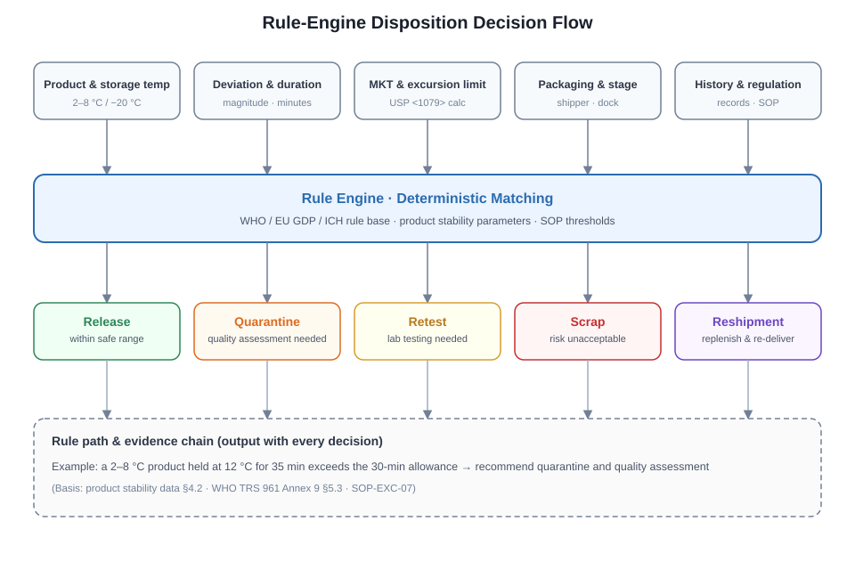
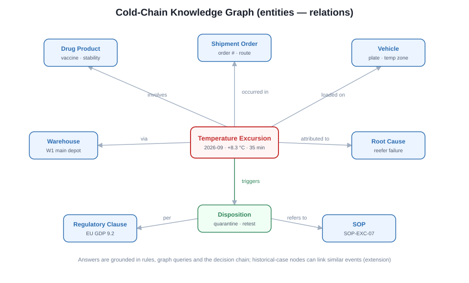
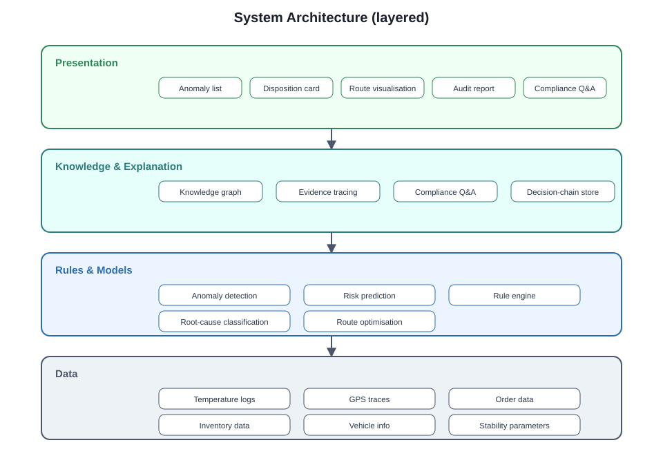
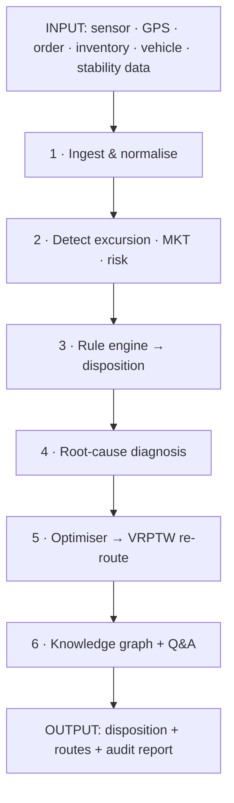
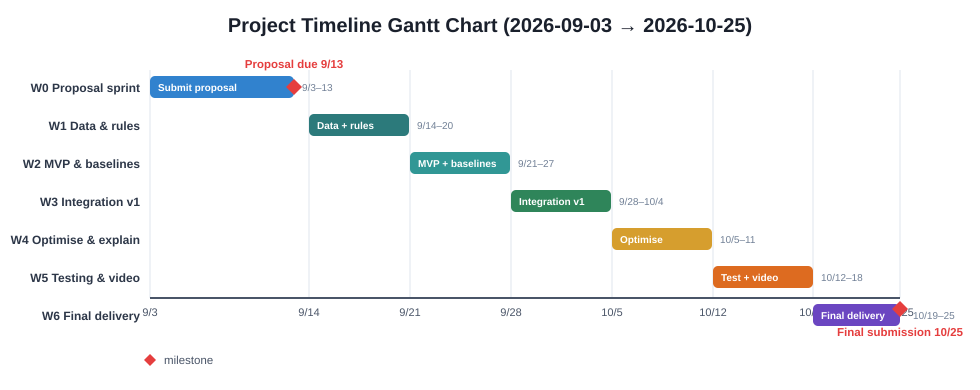

# PharmaColdOps
## An Intelligent System for Temperature-Excursion Disposition and Delivery Re-routing in Cold-Chain Pharmaceuticals

**Formal Project Proposal (4-member team)**
Project code: PharmaColdOps · Course: IRS Practice Module · Team size: 4 (~10 person-days each) · Proposal due: 2026-09-13 · Final submission: 2026-10-25

---

## 1. Project Overview

PharmaColdOps is an intelligent decision-support system for cold-chain pharmaceutical transport and warehousing. It integrates temperature-sensor data, product-stability rules, inventory and vehicle-scheduling capabilities, and a knowledge-graph Q&A into a closed loop: when a temperature excursion occurs, the system does not merely raise an alarm — it issues an explainable disposition recommendation (release / quarantine / retest / scrap / reshipment) and automatically generates an alternative inventory-allocation and delivery re-routing plan.

The project covers all four IRS technique groups: decision automation, resource optimisation, knowledge discovery & data mining, and cognitive systems. Compared with a single-prediction or single-rule system, PharmaColdOps's core advantage is a complete "excursion disposition + logistics re-routing + explainable audit" loop, with clear experiment metrics, a demonstrable result, and a clear business value.

## 2. Problem Definition

Cold-chain pharmaceuticals such as vaccines, biologics and insulin are highly temperature-sensitive. A temperature deviation during transport, warehousing, loading/unloading or airport dwell can compromise product safety and efficacy. The main pain points today are:

- After an excursion, whether to release, quarantine, retest or scrap relies largely on manual judgement, with inconsistent criteria across staff.
- WHO, EU GDP and ICH requirements emphasise deviation recording, assessment, decision and traceability, but existing spreadsheets or simple alarm systems cannot satisfy audit requirements.
- Excursion handling and logistics re-routing are disconnected: systems only alert, and do not answer "should this batch be stopped?", "where does replacement stock come from?", or "how should the new route be arranged?".
- "One-size-fits-all" disposition causes either excessive scrapping or improper release.
- Black-box AI decisions are hard for quality leads and auditors to trust.

This project aims to build an explainable, traceable and quantitatively evaluable system that automatically turns a temperature-excursion event into a compliant disposition recommendation and an executable delivery re-routing plan.

## 3. Background & Domain Foundation

### 3.1 Regulatory foundation

Cold-chain pharmaceutical compliance is governed by the following domain regulations:

- WHO Model Guidance for the Storage and Transport of Time- and Temperature-Sensitive Pharmaceutical Products, TRS 961 Annex 9.
- EU Guidelines on Good Distribution Practice of Medicinal Products for Human Use, 2013/C 343/01.
- ICH Quality Guidelines, in particular the stability and quality-risk-management sections.
- Product-stability data, allowable temperature-excursion durations, and the Mean Kinetic Temperature (MKT) calculation rules.

Existing research mostly addresses single-point tasks — temperature time-series anomaly detection, cold-chain vehicle-routing optimisation, and MKT calculation — and rarely integrates "disposition decision, root-cause diagnosis, alternative stock allocation, delivery re-routing, and compliance explanation" into one system. PharmaColdOps targets this gap with a closed-loop solution.

### 3.2 Related work (literature review)

Work relevant to PharmaColdOps clusters into four areas:

- **Cold-chain anomaly detection & temperature modelling** — time-series anomaly detection (isolation forests, LSTM autoencoders) and Mean Kinetic Temperature (MKT) calculation per USP <1079> underpin the excursion-detection module.
- **Cold-chain / vaccine distribution optimisation** — delivery re-routing is a Vehicle Routing Problem with Time Windows (VRPTW) in the spirit of Solomon's classic benchmark; modern solvers use exact CP-SAT or metaheuristics such as genetic algorithms.
- **Interpretable machine learning** — gradient-boosted trees (LightGBM, XGBoost) are the standard for tabular risk prediction, with SHAP supplying feature-level explanation for quality and audit reviewers.
- **Pharmaceutical knowledge graphs & compliant Q&A** — entity-centric graphs link products, events, rules and SOPs to produce traceable, evidence-backed answers rather than free-form generation.

Most existing work addresses one of these in isolation. PharmaColdOps's contribution is to compose them into a single closed loop — disposition decision, root-cause diagnosis, re-routing, and compliance explanation — with a defensible, non-circular evaluation (§8.3). Compared with black-box single-predictor systems, the rule engine gives the disposition step a deterministic, audit-friendly decision path.

### 3.3 Market landscape & competitors

The cold-chain visibility market is populated but fragmented. Established vendors — Controlant, Elpro, Sensitech (Carrier), Berlinger, Tive and Roambee — focus on real-time temperature logging, shipment visibility and excursion alerting. Air-cargo specialists such as Envirotainer provide active temperature-controlled containers, while logistics providers (DHL, FedEx, UPS Healthcare, World Courier) offer pharma-specific transport. Their shared limitation is that they alert and record, but stop short of an integrated, explainable disposition decision plus automatic re-routing grounded in WHO / EU GDP / ICH rules.

Key trends reinforce the opportunity: tightening EU GDP 2013/C 343/01 enforcement, growth in temperature-sensitive biologics and mRNA vaccines, and rising audit demand for traceable decisions. PharmaColdOps positions itself in the gap between commodity monitoring and bespoke consultancy — an automated, rule-grounded decision layer that turns an excursion into a compliant disposition and an executable reshipment plan.

**Figure 1 — Cold-chain market positioning matrix**

## 4. Stakeholders & Business Value

- **Quality leads / QA** — receive compliant, explainable and traceable release / quarantine / retest / scrap recommendations.
- **Logistics dispatchers** — automatically obtain replacement stock and re-routed routes after an excursion, reducing stockouts.
- **Warehouse / transport supervisors** — identify the root cause of an excursion, e.g. refrigeration-unit failure, doors left open too long, or prolonged transit dwell.
- **Compliance / audit personnel** — obtain the full decision chain, the regulatory basis, and the excursion-disposition report.
- **Patients and end institutions** — benefit from fewer improper releases and more timely reshipment, lowering drug-safety risk and the impact of shortages.

## 5. Overall System Approach

The processing flow is as follows:

1. Ingest temperature/humidity-sensor, GPS, order, inventory, vehicle and product-stability-parameter data.
2. Compute in real time the temperature excursion, excursion duration, MKT and excursion window, and predict whether a temperature deviation is likely within the next 30/60 minutes.
3. The rule engine outputs a disposition level based on product type, excursion magnitude, duration, packaging state and transport stage.
4. The root-cause diagnosis module links the anomaly to the vehicle, warehouse, route, equipment and loading/unloading events.
5. The optimisation module re-routes orders that require reshipment, allocation or re-delivery as a time-windowed, multi-temperature-zone vehicle-routing problem.
6. The knowledge-graph and Q&A module provides explanations such as "why quarantine" and "which SOP/GDP clause", and generates the audit report.
7. Actual disposition outcomes are written back to the knowledge base and risk model, forming a continuous-improvement loop.

## 6. Technical Approach & IRS Technique Mapping

Technique selection is driven by four requirements: audit-grade transparency for the disposition step, strong performance on small tabular datasets, scalable re-routing, and hallucination-free compliance answers. Accordingly we choose a deterministic rule engine (not a classifier) for disposition; gradient-boosted trees (LightGBM / XGBoost) with SHAP for risk and root-cause prediction on tabular data (with LSTM / Transformer as an optional time-series extension); and a greedy-baseline → CP-SAT → genetic-algorithm progression for VRPTW so that an explainable lower bound is always available. The knowledge graph, rather than a free-form LLM, is the source of compliance answers; any LLM is restricted to natural-language polishing.

### 6.1 Technique mapping

| IRS technique group | Implementation in this project |
|---|---|
| Decision automation | Rule engine that decides release / quarantine / retest / scrap / reshipment and outputs a traceable decision chain |
| Resource optimisation | Genetic algorithm or OR-Tools / CP-SAT for cold-chain VRPTW, replacement stock and vehicle scheduling |
| Knowledge discovery / data mining | Temperature-excursion risk prediction, anomaly root-cause classification, quality-risk grading |
| Cognitive systems | Cold-chain knowledge graph + natural-language compliance Q&A + explainable audit report |

### 6.2 Decision automation: rule engine

Input variables include:

- Product category and standard storage temperature (e.g. 2–8 °C, −20 °C).
- Temperature-deviation magnitude and duration.
- MKT and the product's allowable excursion threshold.
- Packaging state, transport stage, and historical anomaly records.
- Regulatory / SOP constraints.

Output decisions include:

- **Release** — the deviation is within an acceptable safety range.
- **Quarantine / retest** — further quality assessment or testing is required.
- **Scrap** — the risk is unacceptable.
- **Reshipment** — replenish from an alternative warehouse and re-deliver.

Every conclusion carries its rule path, e.g. "A 2–8 °C product held at 12 °C for 35 minutes exceeds the product's allowable 30 minutes; therefore recommend quarantine and initiate quality assessment."

**Figure 2 — Rule-engine disposition decision flow**

### 6.3 Knowledge discovery: risk prediction & root-cause diagnosis

Risk prediction uses tabular machine-learning baselines:

- LightGBM and XGBoost as the primary models.
- SHAP to explain key features such as excursion duration, MKT, door-open count and transport stage.
- Optional extension: LSTM / Transformer time-series models for early warning.

Root-cause diagnosis categories include: refrigeration-unit failure, frequent or prolonged door opening, prolonged transit dwell, improper packaging or phase-change-material configuration, and sensor failure or data drift.

### 6.4 Resource optimisation: cold-chain delivery re-routing

Reshipment and re-routing are modelled as a Vehicle Routing Problem with Time Windows (VRPTW), with multi-temperature zones, capacity constraints, driver working hours and stockout priority.

**Figure 3 — Delivery re-routing (VRPTW) schematic**

- **Main constraints:** vehicle capacity and multi-temperature-zone capacity, time windows, driver hours, priority delivery of temperature-sensitive orders, and replacement-warehouse stock availability.
- **Optimisation objectives:** minimise stockout time, minimise scrap loss, minimise total distance / time / carbon emissions, and maximise constraint satisfaction.
- **Implementation strategy:** first generate an explainable greedy baseline, then optimise with OR-Tools / CP-SAT or a genetic algorithm, and report the improvement in on-time rate, cost and scrap loss relative to the greedy baseline.

### 6.5 Cognitive systems: knowledge graph & compliance Q&A

**Figure 4 — Cold-chain knowledge graph**

Knowledge-graph entities include: product, temperature requirement, stability parameter, transport order, vehicle, route, warehouse, temperature event, anomaly cause, disposition recommendation, regulatory clause, SOP and historical case.

The graph may be built with Neo4j or NetworkX. The Q&A system generates answers primarily from rules, knowledge-graph queries and the decision chain. If a large language model is introduced, it is used only for natural-language polishing and is not allowed to generate unverified compliance conclusions.

**Figure 5 — System architecture (layered)**

**Figure 6
### 6.6 System architecture

- **Data layer:** temperature logs, orders, inventory, vehicles, product-stability parameters.
- **Rule & model layer:** anomaly detection, risk prediction, rule engine, root-cause classification, route optimisation.
- **Knowledge & explanation layer:** knowledge graph, evidence tracing, compliance Q&A.
- **Presentation layer:** anomaly list, disposition recommendation, route visualisation, audit report, natural-language Q&A interface.

**Figure 1 — End-to-end system pipeline**

## 7. Data Collection & Preprocessing

### 7.1 Main datasets

| Dataset | Link | Size | Use in project |
|---|---|---|---|
| Cold Chain Shipment Silent Failure Dataset | https://www.kaggle.com/datasets/skarin/cold-chain-shipment-silent-failure-dataset | ~8,000 rows, 24 columns, ~0.94 MB; contains `label`, `silent_failure` | Risk prediction, failure classification, feature engineering |
| Vaccine Distribution with Temperature Logging | https://www.kaggle.com/datasets/manankhanna0/vaccine-distribution-with-temperature-logging | ~26,674 rows, 13 columns, ~2.64 MB | Temperature anomaly detection, excursion-segment identification, MKT simulation |
| Electric Sheep Africa vaccine-cold-chain | https://huggingface.co/datasets/electricsheepafrica/vaccine-cold-chain | 30,000 rows (three 10,000-row CSVs) | Facility / route-level cold-chain anomaly and multi-temperature behaviour analysis |
| Africa Synth Immunization Vaccine Quality Cold Chain All | https://huggingface.co/datasets/electricsheepafrica/africa-synth-immunization-vaccine-quality-cold-chain-all | ~30,000 rows | Data augmentation, cold-chain quality-label supplementation |
| CVRPLIB | http://vrp.atd-lab.inf.puc-rio.br/index.php/en/ | Standard VRP instances | Re-routing algorithm benchmarking |

### 7.2 Domain knowledge sources

- WHO Model Guidance for TTSPPs, TRS 961 Annex 9: https://www.who.int/publications/m/item/trs961-annex9-modelguidanceforstoragetransport
- EU GDP Guidelines, 2013/C 343/01: https://eur-lex.europa.eu/legal-content/EN/TXT/?uri=CELEX%3A32013C0343
- ICH Quality Guidelines: https://www.ich.org/page/quality-guidelines

### 7.3 Preprocessing & synthetic-data strategy

- Merge temperature, GPS, order, inventory and vehicle data; unify timestamps and device IDs.
- Resample by time window; compute temperature mean, maximum deviation, excursion duration, MKT and door-open-event features.
- Interpolate or flag missing values to avoid data leakage.
- Split training / validation / test sets in chronological order.
- Where public data does not cover certain routes, cities or product combinations, generate a synthetic delivery network from public road-network data (OSRM / OpenRouteService) and simulate sensor time series.
- For the 8,000-row risk dataset, use cross-validation, class weights and data augmentation to avoid overfitting.

## 8. Experiments & Evaluation Metrics

### 8.1 Evaluation metrics by module

| Module | Main metrics |
|---|---|
| Risk prediction | Accuracy, Precision, Recall, F1, AUC, PR-AUC, warning lead time |
| Disposition decision | Accuracy, agreement rate vs. expert labels, rule coverage, Cohen's kappa |
| Root-cause diagnosis | Top-1 / Top-3 accuracy, macro-F1 |
| Delivery optimisation | On-time rate, scrap loss, total distance / time, constraint-satisfaction rate, improvement vs. greedy & CP-SAT baselines |
| Cognitive Q&A | Answer accuracy, evidence-traceability coverage, unanswered-without-evidence rate, average response time |
| System level | End-to-end response time, explanation coverage, audit-report completeness |

### 8.2 Baseline design

- Risk prediction: logistic regression, decision tree, LightGBM, XGBoost.
- Root-cause diagnosis: rule matching, Naive Bayes, XGBoost.
- Route optimisation: greedy nearest-neighbour / priority heuristic, OR-Tools / CP-SAT, genetic algorithm.

### 8.3 Disposition ground-truth construction

The disposition module (release / quarantine / retest / scrap / reshipment) is rule-based and therefore has no natural label in the public datasets (which provide only a binary `silent_failure` flag). We therefore construct a human-annotated gold standard as follows:

1. **Scenario bank** — author 40–60 synthetic temperature-excursion scenarios spanning all five disposition classes and boundary cases (near-threshold MKT, borderline excursion duration, different products, packaging states and transport stages).
2. **Independent annotation** — two team members, using only a written WHO/GDP/ICH rule rubric (not the implemented code), independently label each scenario with a disposition.
3. **Agreement & reconciliation** — inter-annotator agreement is measured with Cohen's kappa (target ≥ 0.8); disagreements are reconciled by a third member to form the final gold standard.
4. **Evaluation** — the rule engine is scored against the gold standard using accuracy, macro-F1, per-class precision/recall (emphasising recall of high-consequence classes such as scrap and quarantine), rule coverage, and Cohen's kappa (engine vs. gold standard).
5. **External validation (optional)** — if a supervisor or domain contact is available, they review a 5–10 case subset to validate that the rubric itself reflects real pharmaceutical practice.

This separates rule correctness (human rubric vs. engine) from data-driven correctness (dataset labels for risk prediction and root-cause classification), avoiding the circularity of evaluating rules against the rules that generate them.

## 9. MVP & Scope Control

**In-scope (MVP):**

- Scenario limited to a Singapore or single-city delivery network.
- Products limited to 1–2 categories, e.g. 2–8 °C vaccines and −20 °C frozen drugs.
- Build the rule-engine MVP first, ensuring a temperature event can produce an explainable disposition recommendation.
- Use public datasets plus rule-generated simulated sensor time series.
- Build the greedy route baseline first, then introduce OR-Tools / genetic algorithm and compare improvements.
- Interface includes an anomaly list, disposition recommendation, route visualisation and a Q&A box.

**Extensions (later):**

- Real-time time-series early warning.
- Multi-temperature-zone, multi-warehouse joint optimisation.
- Dynamic maps and real-time vehicle positions.
- Fuller multi-language compliance Q&A.
- Mock ERP / WMS interfaces.

**Explicitly excluded:**

- Production-grade ERP / WMS integration.
- Drug registration, clinical or formal compliance certification.
- Real IoT hardware deployment.
- Real patient data or protected medical data.

## 10. Project Plan & Team Division (4-member)

**Figure 7 — Project timeline gantt chart**

### 10.1 Member roles & responsibilities

| Member | Responsibility | Corresponding module |
|---|---|---|
| A | Project lead, domain rules, decision engine | Decision automation, compliance rules, report |
| B | Data & machine learning | Knowledge discovery, risk prediction, root-cause diagnosis, experiment evaluation |
| C | Delivery optimisation | Resource optimisation, VRPTW, OR-Tools / genetic algorithm |
| D | Knowledge graph, Q&A, integration & frontend | Cognitive systems, backend API, UI, video demo |

### 10.2 Weekly tasks

**W0 (3–13 Sep): Proposal sprint**
- A: define project boundary, MVP scope and 1–2 product categories; draft Introduction, Problem Statement, System Design; collate WHO / GDP / ICH rule sources.
- B: confirm downloadability of the three main datasets and supplementary data; record fields, size and licence; write Data Collection and preprocessing plan.
- C: confirm CVRPLIB and OR-Tools feasibility; define VRPTW inputs, outputs and objective function; write the optimisation experiment design.
- D: design the initial knowledge-graph entity-relationship schema; confirm Neo4j or NetworkX; write the system architecture and demo plan.
- *Week deliverable: complete and submit the Proposal.*

**W1 (14–20 Sep): Data & rule preparation**
- A: compile the disposition rule table for 1–2 product categories; define fields, thresholds and rule paths for release / quarantine / retest / scrap / reshipment.
- B: download and unify datasets; handle missing values and outliers; build base features (excursion duration, MKT, door-open count, transport stage); output a data dictionary.
- C: generate or select 20–50-node VRPTW instances; implement the greedy baseline; define constraints and objective function.
- D: set up the GitHub repository and directory structure; configure the dev environment; complete knowledge-graph schema v1.
- *Week deliverable: usable data, rule table v1, runnable greedy baseline.*

**W2 (21–27 Sep): Rule-engine MVP & model baselines**
- A: implement rule engine v1; output disposition recommendations and rule evidence from a temperature event; prepare 20 test cases and unit tests.
- B: build chronological train / validation / test splits; train LightGBM and XGBoost risk-prediction baselines; compute F1, AUC, PR-AUC; produce initial SHAP output.
- C: finalise the optimisation interface; consume "reshipment orders" from the rule engine; implement an initial time-windowed, capacity-constrained optimisation model.
- D: build knowledge-graph data-loading scripts; import product, rule and case nodes; complete the backend API skeleton.
- *Week deliverable: rule-engine MVP demo, risk-model baseline report, optimisation interface v1.*

**W3 (28 Sep – 4 Oct): End-to-end integration v1**
- A: link the rule engine with B's risk model; collate rule coverage and agreement with human labels; begin the report methodology.
- B: complete the root-cause classification model; align features with the rule engine; output Top-1 / Top-3 accuracy and F1; prepare experiment tables.
- C: complete the "reshipment order → warehouse selection → route re-routing" main flow; implement OR-Tools / CP-SAT v1 and compare with the greedy baseline.
- D: wire the "anomaly list → disposition recommendation → route result" API; complete a basic frontend; implement the knowledge-graph query interface.
- *Week deliverable: end-to-end v1 demo — a temperature anomaly produces a disposition recommendation and a re-routed route.*

**W4 (5–11 Oct): Optimisation & explanation enhancement**
- A: refine explainable disposition output; generate the audit-report template; draft the user manual.
- B: add data augmentation or class weights and tune the risk model; refine SHAP explanations; prepare failure-case analysis.
- C: tune the genetic algorithm or OR-Tools; add multi-temperature-zone and stockout-priority constraints; systematically compare greedy, CP-SAT and genetic algorithm.
- D: complete knowledge-graph Q&A v1; implement "why quarantine" and "which rule" queries; integrate the decision chain into the explanation interface.
- *Week deliverable: optimisation comparison results, audit-report template, Q&A v1.*

**W5 (12–18 Oct): Integration testing & video**
- A: organise full-flow and boundary-case testing; check completeness of compliance evidence; complete the report first draft.
- B: finalise experiment scripts and reproducibility; aggregate all metrics; support A on the experiments chapter.
- C: fix optimisation-scenario issues; output final route-visualisation data; support the demo script.
- D: complete the UI and Q&A module; prepare the two 5-minute video scripts, pages and demo data; finish the GitHub README.
- *Week deliverable: full flow demonstrable, report first draft complete, video scripts complete.*

**W6 (19–25 Oct): Final delivery**
- A: final review of the Proposal / final report, user manual, individual reflection; check technical coverage and deliverables against the course rubric.
- B: pre-submission check of data and experiment reproducibility; package data notes, preprocessing scripts and experiment scripts.
- C: pre-submission check of optimisation results and baselines; tidy GitHub code and run instructions.
- D: complete video editing, subtitles and final demo; produce the report zip; final GitHub tidy-up.
- *Week deliverable: by 25 Oct, submit GitHub, two 5-minute videos, report zip, user manual and individual reflections.*

## 11. Risks & Mitigation

| Risk | Mitigation |
|---|---|
| Risk-prediction dataset is small | Use tabular models, cross-validation and data augmentation; complement with the 26,674-row and 30,000-row datasets |
| Disposition rules are domain-complex | Limit to 1–2 product categories and build a small rule set from public WHO / GDP / ICH rules |
| Route-optimisation problem too large | Start with a greedy baseline, then gradually introduce OR-Tools / genetic algorithm; control the node count |
| Q&A may produce unverified conclusions | Answers generated only from rules, knowledge graph and decision chain; LLM used only for language polishing |
| Scope creep prevents completion | Define the MVP boundary clearly; use module interfaces and weekly integration |
| Kaggle download / login restrictions | Use Hugging Face sources, CVRPLIB and synthetic data as alternatives |
| Data copyright or usage restrictions | Research-only use; comply with each platform's licence and cite sources in the report |

## 12. Final Deliverables

- GitHub code repository: data processing, models, rule engine, optimisation algorithm, knowledge graph and frontend.
- Formal project report.
- User manual.
- Two 5-minute project-demonstration videos.
- Report and code packaged as a zip.
- Individual reflection documents.
- Experiment scripts and reproducibility notes.

## 13. Conclusion

PharmaColdOps addresses a real, high-stakes gap in pharmaceutical cold-chain operations: turning a temperature excursion into a compliant, explainable disposition and an executable re-routing plan, rather than a mere alarm. By composing a rule engine, interpretable machine learning, VRPTW optimisation and a knowledge-graph Q&A into one closed loop, the project spans all four IRS technique groups and bridges academic reasoning techniques with a tangible market need.

Its two defining strengths are audit-grade explainability and a non-circular evaluation design (§8.3) that separates rule correctness from data-driven correctness. The MVP is deliberately scoped — a single-city, one-to-two-product network with the rule engine built first — so that the core loop is demonstrable within seven weeks, with the final deliverables (repository, report, user manual, videos) ready by 25 October 2026.

## 14. References

- WHO Model Guidance for the Storage and Transport of Time- and Temperature-Sensitive Pharmaceutical Products: https://www.who.int/publications/m/item/trs961-annex9-modelguidanceforstoragetransport
- EU Guidelines on Good Distribution Practice, 2013/C 343/01: https://eur-lex.europa.eu/legal-content/EN/TXT/?uri=CELEX%3A32013C0343
- ICH Quality Guidelines: https://www.ich.org/page/quality-guidelines
- USP <1079> Good Storage and Distribution Practices for Drug Products (Mean Kinetic Temperature definition): https://www.usp.org/
- Solomon, M. M. (1987). Algorithms for the Vehicle Routing and Scheduling Problems with Time Window Constraints. *Operations Research*, 35(2), 254–265.
- Chen, T., & Guestrin, C. (2016). XGBoost: A Scalable Tree Boosting System. *ACM SIGKDD*.
- Ke, G., et al. (2017). LightGBM: A Highly Efficient Gradient Boosting Decision Tree. *NeurIPS*.
- Lundberg, S. M., & Lee, S.-I. (2017). A Unified Approach to Interpreting Model Predictions. *NeurIPS*.
- Google OR-Tools: https://developers.google.com/optimization
- Cold Chain Shipment Silent Failure Dataset: https://www.kaggle.com/datasets/skarin/cold-chain-shipment-silent-failure-dataset
- Vaccine Distribution with Temperature Logging: https://www.kaggle.com/datasets/manankhanna0/vaccine-distribution-with-temperature-logging
- Electric Sheep Africa vaccine-cold-chain: https://huggingface.co/datasets/electricsheepafrica/vaccine-cold-chain
- Africa Synth Immunization Vaccine Quality Cold Chain All: https://huggingface.co/datasets/electricsheepafrica/africa-synth-immunization-vaccine-quality-cold-chain-all
- CVRPLIB: http://vrp.atd-lab.inf.puc-rio.br/index.php/en/

---

## 15. Supplementary Note: Use of AI

Generative AI (Claude) was used in the preparation of this proposal to draft, translate and structure the document, and to help design the evaluation methodology and the presentation deck. All technical content, references, datasets and rule/regulation details were reviewed and verified by the team; AI output was used as a drafting aid, not as a source of domain decisions. Final responsibility for the proposal's accuracy rests with the team.
