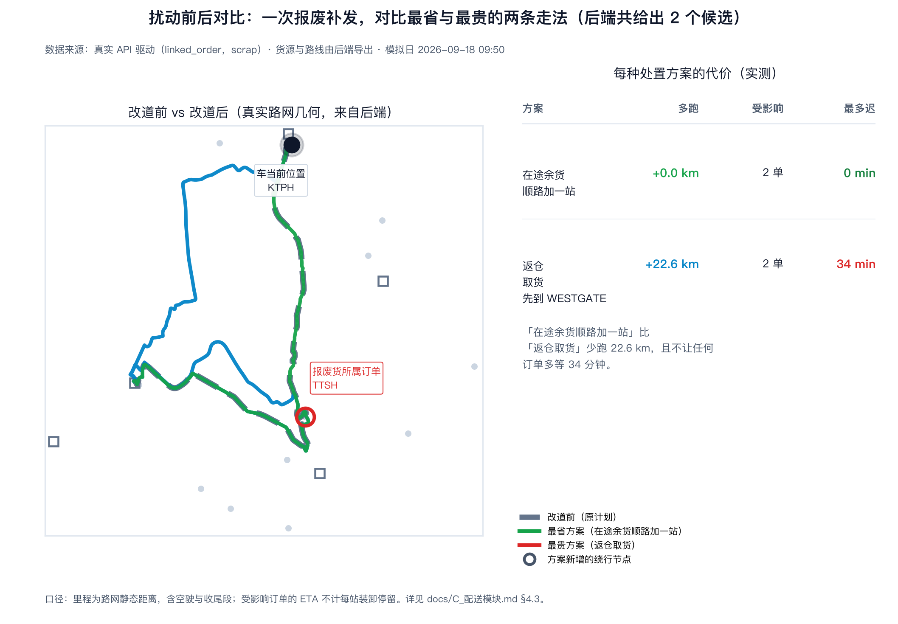

# C 配送模块（VRPTW / 调度）总纲

> 2026-09-14 整合。本文件合并了原先分散的五份 C 模块文档（待办清单 / 问题待解决 / 日常配送重构方案 / 代码实施计划 / 共享数据库说明），**是 C 模块唯一的文档入口**。
> 相关跨模块文档：[接口契约.md](接口契约.md) · [前端接线契约.md](前端接线契约.md) · [KG_SCHEMA_v1.md](KG_SCHEMA_v1.md) · [singapore_network_assumptions.md](singapore_network_assumptions.md)

---

## 0. 接手须知（先读这段）

**一句话现状（2026-09-30 校准）**：能跑通「**日常配送主线**（批次订单 → 多站排线 → 建单 → 发车 → 地图实时进度 → 送达 → 收工停靠）＋ **支线扰动**（温度异常 → A 判定 → 报废救援候选比较 → 插入当天计划）＋ **机械故障替代配送**（故障车冻结 → 备用车替代库存配送）＋ **延误主动巡检与重排**（自动发现风险 → 比较站序 → 确认重排 → 按新时间线继续配送）」全链路。最新验证结果见 `PROGRESS.md` 顶部。
**2026-10-01 补充**：执行层现按车保存实际起点／时间线，修复非主仓地图与故障替代车误投递；应急路径共用硬约束与累计里程。
跨天停车已从只读建议接成确认位移、停妥、次日建单的闭环，库存继承剩余量且新增供货须明确登记。
当前实现与验收详见 [路径规划总逻辑方案.md](路径规划总逻辑方案.md) §8.13 与 `PROGRESS.md` 顶部。
**一句话问题**：运行中的 PDPTW 救援／插单仍不支持；前端第二批和独立加急录入尚未全部完成，不能把基础演示当作全项目验收。
**一句话下一步**：补齐独立加急单录入入口（交接稿 G4），并完善配送优化章节、演示脚本与干净环境复现交付物；§4.3 扰动前后对比图已完成。
**~~唯一待拍板~~**：日常订单来源已于 2026-09-14 拍板（固定演示集 + `?seed=N`），见 §4.5。

> ⚠️ **本文件在 2026-09-16/17 有一批实现落地（B1b/B4–B7 + PDPTW 步骤 1–4）后，正文多处曾滞后于代码。**
> 已于 **2026-09-18 按代码逐条校准**，凡与新实现冲突处均标了「2026-09-18 校准」。
> 权威的逐批实施记录在 [路径规划总逻辑方案.md](路径规划总逻辑方案.md) §8 与 `PROGRESS.md` 顶部。

> **2026-09-14 复核（A 侧代做的一批，详见 §5）**：**A1–A3 已完成**——
> GA 求解器落地（`src/optimisation/ga_solver.py`，**纯标准库，不再需要 deap**）；
> 三方对比表已重跑且可复现（`python scripts/run_routing_baselines.py --time-limits 10 30 60`）。
> **A2 的原因诊断已更正**：不是"时限太短"，而是 OR-Tools 的默认首解策略在 r101/rc101 上
> **构造失败**（10s/30s/60s 都返回空解）。§5 A4 与 §5 E 里另有两条已过时的说法一并更正。
>
> **2026-09-16/17 复核（C 侧大批落地，**本文件正文已按代码校准**）**：§4 重构的**第 1、2 层已完成**；
> **B1–B7 全部完成**（里程上限、终点站、调度约束界面、多货源点起点、收工停靠、不可行理由、报废救援全链）；
> **PDPTW 取送模型步骤 1–4 完成**（规划侧 + 执行侧，默认仍走 `grouped`）。详见 §2 表、§4.2、§5 B0–B7 与
> [路径规划总逻辑方案.md](路径规划总逻辑方案.md)。

启动方式：
```bash
# 后端（仓库根）
.venv/bin/python -m uvicorn --app-dir src api.main:app --port 8000
# 前端（需 Node）
cd frontend-vue && pnpm install && pnpm build && pnpm preview
# 浏览器：http://127.0.0.1:4173/?api=http://127.0.0.1:8000
pytest -q            # 全量回归
```

> **Windows 本机（2026-09-18 实测）**：解释器是 `.venv\Scripts\python.exe`；
> Vite 用 `npm run dev`（只绑 IPv6，**必须用 `localhost` 而不是 `127.0.0.1`**，端口被占会自动 +1）；
> 完整配方（含端口占用排查、改了后端要重启 uvicorn）见 `HANDOFF.md` §6.1 与 §7。

---

## 1. 业务目标（要做成什么样）

- **按订单配送**：医院要什么、多少、几点收货，就安排相应任务；不再每次跑全部十家医院。
- **检查库存和车辆**：只用可用的合格货物；数量、车辆容量、温层和收货时间必须匹配。
- **记住运输进度**：车辆在哪里、载哪些订单、哪些已送完、还剩哪些。重算不能让车凭空回仓，也不能重复交付。
- **紧急插单**：比较未出发车辆带货、在途车辆插单、回仓取货、备用车专送。车有空位不等于有药，取货也要算时间。
- **异常补发**：接 A 的真实处置结果，关联具体批次和医院，只针对受影响需求补发；原货隔离与新货补发分开记录。
- **故障救援**：☑ 已实现机械故障 v1（2026-09-30）：冻结已完成交付、停止故障车的未完成订单、比较同温区备用车的替代库存配送。当前不假定车对车或冷藏设施转运能力；未建立合法路径时明确拒绝。
- **延误处理**：检查预计到达时间、收货窗口和有依据的运输截止时间；赶不上时给调整建议或明确说明无法满足。
- **有限资源**：库存不足、无车、温层不符时不能编造可行方案，列出未服务订单及原因。
- **方案解释**：展示调整前后路线、原因、增加的距离、预计迟到和影响订单；能回溯到异常事件。
- **算法与交付**：补 GA 和三算法公平对比、动态场景评估、报告、演示、运行说明及干净环境复现。

### 1.1 必须分清的业务逻辑（纪律）

- 药品资料、医院订单、库存批次、运输任务和温度异常**不是同一件事**。
- A 判断药品是否允许配送；**C 使用该结果安排运输，不自行恢复隔离货或判药品报废**。
- 隔离不等于无需补发；原货处理和医院补货需求是两条关联的流程。
- 异常影响哪批货，要依据车辆/包装/批次关联，不默认一单或整车全部受影响。
- 现有 MKT 和时长规则**不能预测真实剩余保质期**。运输时限需注明依据；演示设定明确标为模拟。
- 改送其他医院需合格货物、实际需求、接收条件和授权，属后续可选扩展。
- ML 风险提示不等于已确认设备故障。C 接确认后的车辆状态，保留信息来源。

### 1.2 完成后的演示路径

加载医院订单 → 排线 → 模拟出发和交付 → 紧急加单或异常 → A 处置 → C 调整 → D 展示和留档。
能演示：正常配送、单医院补发、在途插单、故障接替、资源不足。
初版采用模拟时钟与设施节点上的车辆位置。真实 GPS、多仓库选址、医院门户、药品寿命预测和新深度学习模型**不作为完成条件**。

---

## 2. 现状：已经能用的东西（不要重写）

| 模块 | 能力 | 位置 |
|---|---|---|
| 静态求解 | 贪心（最近邻+时间窗插入）、OR-Tools Routing | `greedy.py` / `ortools_solver.py` |
| **GA（2026-09-14 新增）** | 遗传算法：客户排列编码 + 顺序交叉 + 短程变异 + **最优 split 解码**（DP），输出同一个 `ReplanResult` | `ga_solver.py` |
| **多站环线规划** | 按订单排线，**一辆车串多站**（实测 4 家医院 1 车 → 单车站序 `3→4→1→2`／**51.03 km**；开环后可降到 27.99 km） | `dispatch_planner.plan_delivery_orders()` |
| **车队硬约束（2026-09-16）** | API 可限制车队总数和每车最多站点；演示默认最多 3 辆、每车 4 站，贪心与 OR-Tools 同时执行 | `DispatchConstraints` + `DispatchPlanIn.constraints` |
| 真实路网 | 新加坡 **1 主仓 + 1 第三方仓 + 14 个接收点 + 3 个分拨点 = 19 节点**（11 公立医院 + 3 私立），19×19 距离/时间矩阵 + 342 条道路几何（2026-09-16 由 15 节点扩至 19，主仓移至裕廊东思家客） | `data/optimisation/singapore/network.json` |
| **里程上限 + 终点站（2026-09-16）** | `constraints.mileage_limit_m` 是**每车每天**的硬里程上限（含空驶与收尾段）；`constraints.terminal_facility_ids` 让路线**开环**——末段去最近的终点站、不计返仓里程。实测 4 家医院：闭环 38.23 km → 开环 27.99 km；上限 25 km 自动变 2 车；上限 12 km 明确报"无法服务" | `routing.evaluate_route()` / `greedy.py` / `ortools_solver.py`（Mileage 维度 + dummy 终点节点）/ `dispatch_planner.py` / `tracking.vehicle_track(end_node=…)`，测试 `tests/test_route_limits.py` |
| **产品目录 + 供货表（2026-09-16，B1 数据面）** | 产品收敛为 **4 种**（权威清单在 A 的 `rules_config.json`，测试断言两边必须一致）；供货表给出"哪个节点、有哪种货、有多少"——**主仓全 4 种，分拨点各最多 2 类**。有台账时以台账聚合为准（真实 0 不被演示值掩盖） | `data/optimisation/product_catalog.csv` · `supply_points.json` · `src/optimisation/catalog.py`，测试 `tests/test_catalog_and_supply.py`（20 条） |
| **订单带起点／多货源点（2026-09-16，B1b/B4）** | 订单可选 `origin_facility_id`（不给＝主仓）；规划器按**（温区 × 货源点）**分组，每组把该货源点当出发仓求解——里程／时间窗／载重／终点站都作用在**真正会发生的那段路**上。起点必须是能供该产品的货源点（医院永不能当起点）。实测：后港取货送竹脚 **20.85 km**，同一单从主仓出发 **28.8 km** | `dispatch_models.DeliveryOrder` / `dispatch_planner.py` / `singapore_loader.load_singapore_subset(origin_facility_id=…)`，测试 `tests/test_multi_origin.py`（13 条） |
| **不可行理由（2026-09-16，B7）** | 对每张未服务订单**真的**试插每条现有路线（以及一辆空车），用与求解器同一个 `evaluate_route` 判定，记录**被哪条约束挡住**与**实测数值**（取最接近可行的那次尝试）：`mileage_limit_exceeded` / `time_window_infeasible` / `capacity_exceeded` / `closing_window_exceeded` / `stop_limit_exceeded` / `no_vehicle_available` / `placeable_in_isolation`。界面逐条渲染中文说明 | `src/optimisation/feasibility.py`，测试 `tests/test_feasibility_reasons.py` |
| **收工停靠选址（2026-09-16，B5）** | 按次日固定订单试排拿到每车**首站** → 在 `terminal_facility_ids` 里选离首站最近者过夜 → 位移计入**当日**里程，预算不够就原地不动并说明原因。实测：上限 60 km → 移到武吉士，次日首段省 7.4 km；**如实声明**买到的是"次日更短首段/更早出发"，不是两日总里程更省 | `src/optimisation/overnight.py` + `POST /api/dispatch/overnight-plan`，测试 `tests/test_overnight_parking.py`（8 条） |
| **报废救援全链（2026-09-16，B6）** | 四类候选：`add_stop_in_transit`（在途车用**车上余货**顺路加一站，不回仓库，须同产品同温区）/ `load_before_departure` / `return_to_depot` / `spare_vehicle`。取货点改为**绕路最少**的合格货源点（供货表给许可、台账给事实）；出事车剩余站序做**有界 2-opt**（只接受不让原本准时订单变迟到的交换）；**在途报废**（货还在车上）时该单从队列摘出并置 `scrapped`——摘出而非标已送达，否则时钟会把报废货记成送达。实测：余货方案 +7.70 km vs 返仓 +46.90 km | `dynamic_problem.py` / `dispatch_state.py` / `service.py`，测试 `test_rescue_order_link.py` · `test_rescue_pickup.py` · `test_rescue_resequence.py` · `test_rescue_onboard_scrap.py` |
| **PDPTW 取送模型（2026-09-16/17，步骤 1–4）** | 一个温区一个实例，**一车串多个不同货源点**：`Node.kind`/`pair_id`、有符号载重（违规按**峰值**判）、`pairing_violation` 捕获"先送后取"、OR-Tools `AddPickupAndDelivery` + 载重下界 0、贪心**成对插入**、GA 对配对实例**显式拒绝**。执行层用 `PlannedStop` 行驶序列，**能建单能发车**。**开关** `constraints.routing_model`，默认 `grouped`（老路径逐字节未动） | `models.py` / `greedy.py` / `ortools_solver.py` / `dispatch_planner.py` / `dispatch_state.py`，测试 `test_pickup_delivery_core.py` · `_loader` · `_planning` · `_execution` |
| **地图运输视图（2026-09-15）** | 分腿几何（已完成灰虚线带 ✓ / 剩余实线带站号）、支线红虚线圈、改道前后对比（灰=改道前、红=改道后，几何来自后端）、大图视图、**真暂停**（0 倍速真冻结）、跟随车辆、图例。实测同一支线：余货 +7.70 km vs 派备用车 +41.48 km vs 返仓 +46.90 km | `TransportView.vue` / `LeafletMap.vue` / `stores/overlay.js`，后端 `route_view.routes[].legs` |
| 业务模型 | 订单 / 库存批次 / 车辆能力（温层、容量、起点、状态） | `dispatch_models.py` |
| **今日配送计划（2026-09-14 新增）** | 一批日常订单 → 一车串多站环线 → 操作员预览 → 确认建作业；订单来源＝固定演示集或 `?seed=` 随机 | `daily_orders.py` + `GET /api/dispatch/daily-orders`，界面在 `ReroutePanel.vue` |
| 状态机 | 接单→发车→逐站送达→完成，命令幂等、frozen dataclass | `dispatch_state.py` |
| 持久化 | SQLite（本机）/ PostgreSQL（团队共享），版本条件更新防覆盖 | `dispatch_repository.py`，见 §7 |
| **急单候选（2026-09-15 扩为四类）** | `add_stop_in_transit`（在途余货）/ `load_before_departure` / `return_to_depot` / `spare_vehicle`，均带容量 / 连带迟到校验；排序口径可切换（`minimize_disruption` 默认 / `minimize_vehicles`） | `dynamic_problem.py`，界面 `ReroutePanel.vue` |
| **模拟时钟与车辆位置** | 位置沿真实路网按距离插值**推导**，1×/60×/300× 倍速 | `tracking.py` |
| 补发桥 | 结案记录 → `DeliveryOrder`（带 `source_run_id` 可回溯），温层按产品映射 | `reshipment.py` |
| 前端 | Vue 3 唯一前端，Leaflet 真实地图、车辆平滑移动、可点选车辆、倍速切换 | `frontend-vue/` |

**关键设计约束（后续改动请守住）**：车辆位置是**推导值，不入库**；状态机仍是"发生了什么"的唯一权威；`tick` 只能产出普通的、幂等的送达命令。这样审计链不会被仿真污染——任何时刻都能回答"这条记录是谁、凭什么写下的"。

> 命名提醒：OR-Tools 用的是 **Routing Solver + Guided Local Search**，**不是 CP-SAT**，报告统一口径时勿写错。

---

## 3. 核心结构问题（本模块当前最大的坑）

> **2026-09-18 校准：本节三条已全部消解**，保留原文作为"为什么当初要重构"的记录。
> 逐条现状见下方各条末尾的 ☑ 标记。

### 3.1 因果反了
没有温度异常就**压根不存在配送作业**：`service.route_reshipment()` 在第一张补发单到来时才 bootstrap 一个作业。"今天要送哪些货"这个概念在系统里不存在。

> ☑ **已解决（2026-09-14 第 1 层 + 2026-09-15 第 2 层）**：现在主线是
> 「🎲 生成今日配送计划 / ⚡ 一键生成并建作业」建出当天的 `PLAN-` 作业，**异常只是插进这条主线的扰动**。
> `route_reshipment()` 的 bootstrap 分支**已删除**——没有进行中的计划就返回 **409「请先建立今日配送」**，
> 既不再静默造一单作业，也不死锁。`RESHIPMENTS-` 前缀与 `active_reshipment_run()` 一并删除。

### 3.2 优化器被架空（对报告是硬伤）
`plan_delivery_orders()` 本来就会排多站环线，但 `route_reshipment()` 只在开第一单时用它，之后每单都走 `accept_emergency_order()` 往某辆车队列里塞一单。**等于把路径优化系统用成了一对一派车器。**

后果：一单一车时**贪心 / OR-Tools / GA 解完全相同**。VRPTW 对比表是核心交付物，但在实际演示里会是三行一样的数字，优化模块的价值在系统里看不出来，只有 Solomon 标准算例上才有差异。

> **2026-09-14 补充**：Solomon 标准算例上的三方对比表已经跑出来了（§5 A3），
> 差异确实存在且不小（例如 R201：贪心 5 车/1884.36 vs OR-Tools 4 车/1275.38），
> 所以问题**不在算法，而在系统用法**——这正是 §4 重构要解决的。
>
> ☑ **已解决（2026-09-14/16）**：排线现在**每批订单都真的走求解器**，且约束是硬的
> （温区分组、车队上限、每车最多站数、每车每日里程上限、终点站开环、多货源点起点）。
> 一车串多站已是默认形态：实测 4 家医院 1 车 → `3→4→1→2`（51.03 km）；上限收紧到 25 km 时
> **自动变 2 车**；12 km 时明确报"无法服务"并列出被哪条约束挡住、差多少。

### 3.3 目的地/数量只能凭空捏
异常事件不挂在任何订单上 → "补发去哪、补多少"无从推导（详见 §5 B0）。

> ☑ **已解决（2026-09-16，B6 第一半）**：`EventIn.order_id`（可选）把异常挂到具体订单上；
> 服务端从进行中的作业解析它（`service._linked_order()`），再取该订单的**产品 / 收货医院 / 数量**，
> 并从 `assignments` 得知在哪辆车、从 `reservations` 得知涉及哪些批次。
> 响应新增 `order_source ∈ {linked_order, event_fallback}` 标明来源，不给 `order_id` 时旧行为不变。
> 收货医院下拉框因此可以退休（保留为手动兜底）。

---

## 4. 重构方案：以「日常配送」为主线

> 已与用户讨论定稿。**第 1 层「今日配送计划」已于 2026-09-14 实施**（见 §4.1 的实施记录）；
> **第 2 层（补发改为扰动）已于 2026-09-15 实施**（见 §4.2 实施记录）：支线事件现在挂到当天的计划上，
> 且「改现有车 vs 另派车」的比较已可在界面上看到并选择；第 3 层（扰动前后对比）仍未做。

### 4.1 第一层 · 今日配送计划（基线，现在完全没有）
一批日常订单（多家医院 / 数量 / 收货窗）→ `plan_delivery_orders()` 排线（一辆车串多站）→ 操作员看方案（里程 / 车辆数 / 可行性）→ **确认发车** → 时钟启动 → 车队跑环线。
急单多、装不下或赶不上窗口时，规划器**自己**会用第二辆车，而不是靠人硬塞。

> **2026-09-14 已实施。要写的东西比预想的少**：`POST /api/dispatch/runs` 的 `orders`
> **本来就是数组**、`plan_delivery_orders()` 本来就会串站——**缺的只是「一批订单从哪来」与「界面看得到」**。
> 1. **订单来源**：新增 `src/optimisation/daily_orders.py` 与 `GET /api/dispatch/daily-orders`
>    （默认**固定演示集**；`?seed=N` 给可复现的随机批次；响应里的 `note` 明写模拟数据声明）。
> 2. **界面**：配送面板新增「🎲 生成今日配送计划」→ 预览（里程／车辆数／服务设施数／每车站序）
>    → 「确认该计划并建立配送作业」→ 发车。前端此前**从未调用过** `/api/dispatch/plan` 与建单的
>    `/api/dispatch/runs`，所以多站排线在运行时**从未被触发过**。
> 3. **可见性修复（关键）**：`/api/dispatch/active` 原先只认 `RESHIPMENTS-` 前缀，手工建的
>    `PLAN-…` 作业对它不可见（实测返回 404）。现改为按「最近被写入的作业」解析，两条路径建的作业都能显示。
>    顺带修掉一个真实缺陷：本地 SQLite 表**从来没有 `updated_at` 列**（只有 Postgres 建表语句里有），
>    导致「哪个作业最近被动过」在本地无法回答；已按 `context_json` 的同一套轻量迁移补上。
> 4. **实测**：4 家医院 1 辆车 → 单车站序 `3 → 4 → 1 → 2`（51.03 km，4/4 服务）；另一随机种子下
>    `8 → 4 → 9 → 10`（70.64 km）。`route_view` 带 `geojson`，地图直接可画环线。

### 4.2 第二层 · 执行中的扰动（重调度真正的战场）
| 扰动 | 现状 |
|---|---|
| **急单/支线插入** | ☑ **四类候选 + 容量/余货/连带迟到校验 + 候选比较界面（2026-09-15）** |
| **温度异常 → 报废 → 补发** | ☑ **作为扰动插入当天的计划**（不再自己开作业）；☑ **已挂到原订单上**（`EventIn.order_id`，2026-09-16，见 §3.3 / §5 B0） |
| **车辆故障** | ☑ **机械故障救援 v1 已完成**：`failure-preview` 比较同温区备用车，`failure-accept` 将故障车未完成订单标为失败并建立可追溯替代订单；报废/质量事件救援也仍可用。当前不建模车对车或冷藏设施转运 |

> **2026-09-15 实施记录（§4.4-2 完成）**：支线不再 bootstrap。
> `service.route_reshipment()` 原来看 `RESHIPMENTS-` 前缀，没有就**自己建一条只有一单的作业**——这正是 §3.2 的病根。
> 现在它只挂到**进行中的今日计划**上（`active_plan_run()`，按 `updated_at` 判定"最新的、未完成的计划"），
> 没有计划就返回 **409「请先建立今日配送」**，既不静默造作业、也不死锁。
> 顺带把"改现有车的路线"补齐成两条真实路径：**用车上余货顺路加一站**（新增候选 `add_stop_in_transit`，
> 货不从仓库走）与**折返仓库取货再送**（原有）；口径可在界面上切换（§5 D1）。
> 实测（本机 API，4 家医院的当日计划、车已发车）：余货方案 ETA 550 vs 折返 565 vs 另派车 565，
> 即"顺路加一站"比折返省一次回仓（15 分钟），而"另派车"不打扰任何在途订单。

### 4.3 第三层 · 扰动前后对比 ☑ **已完成（2026-09-18）**
多跑多少公里 / 谁被拖迟 / 哪辆车改了线。既是 §1 要的"方案解释"，也是报告里最有说服力的一张图。



> 配图：[dispatch_disruption_comparison.png](figures/dispatch_disruption_comparison.png)（矢量版同名 `.svg`）
> **生成方式**：`python scripts/plot_disruption_comparison.py`
> ——它驱动**真实 API** 走一遍操作员会走的顺序（🎲 出今日批次 → 建作业 → 发车 → **把模拟时钟放到
> 目标分钟** → 结案一个挂到在途订单上的报废案例 → 取支线预览），然后把后端返回的东西原样画出来。
> 时钟是**放**上去的而不是等出来的（`position_clock`）：等真实时间会让车队每次落在略不同的分钟上，
> 而车在哪、谁被拖迟全由那一刻决定，图就不可复现了（见上表口径）。

**这张图想说的三件事**（全部是流程图里那一步的实测，不是示意）：

| 内容 | 来源 |
|---|---|
| **改道前**那条灰虚线 | `baselines[vehicle].route_geojson` —— 该车**从当前位置起**剩余的那段，不是从仓库起 |
| **改道后**的彩色实线 | 每个候选自己的 `route_geojson`（`node_sequence` 决定，含取货腿） |
| **多跑多少 / 谁被拖迟** | `added_distance_m`（＝候选序列里程 − 基线序列里程）与 `affected_orders[].delay_min` |

**一次实测（2026-09-21 起逐字节可复现）**：5 家医院、车已发出、在 KTPH 还剩两站时报废一单疫苗，
后端给出两个候选——

| 方案 | 多跑 | 受影响 | 最多迟到 |
|---|---|---|---|
| 在途余货顺路加一站 | **+0.0 km** | 2 单 | 0 min |
| 返仓取货 | **+22.6 km** | 2 单 | **33.5 min** |

即"改这辆车的路线"与"回仓库"的差别，在这张图上就是**一条绕回仓库的回头线**与它换来的半小时延误。

> **口径（报告里要一起写）**：里程是路网**静态**距离、含空驶与收尾段；受影响订单的 ETA
> **不计每站装卸停留**；报案时刻决定车在哪，所以换一个时刻拓扑相同、数字会略变
> （这正是"扰动"的含义）。
>
> **数据契约由测试钉住**（`tests/test_disruption_figure.py`，4 条）：车队在途时预览**真的会给出多个方案**、
> 基线**从车当前位置起**而不是从仓库起、每个候选的 `added_distance_m` **等于**由提交路网重算的序列差、
> 连带延误**归属到真实订单**。任何一条退化，图还是会照画——所以钉在这里。
> 测试把时钟**放到** `CLOCK_TARGET_MIN`（而不是回拨后等），所以这 4 条是确定性的、秒级完成；
> 图本身也逐字节可复现，重跑不会引入像素漂移。

> 💡 地图上那两条线（灰虚线＝改道前 / 红实线＝改道后）在界面上早就是它的**实时版**
> （`TransportView.vue`）；这张图是同一件事**事后可放进报告的静态版**。

### 4.4 具体改动清单

1. ☑ **今日配送的建立已完成（2026-09-14）**：复用 `/api/dispatch/runs`（`create_dispatch`），
   补上「订单从哪来」（`daily_orders.py` + `/api/dispatch/daily-orders`）与前端按钮/预览，
   并修好 `/api/dispatch/active` 只认 `RESHIPMENTS-` 的可见性问题。详见 §4.1 的实施记录。
2. ☑ **补发不再自己开作业（2026-09-15 完成）**：`service.route_reshipment()` 已去掉 bootstrap 分支——
   有当天作业就作为扰动插入，没有就报错"请先建立今日配送"（HTTP 409），不再悄悄造一个一单作业。
   连带改动：`RESHIPMENTS-` 前缀与 `active_reshipment_run()` 已删除，`active_plan_run()` 取而代之；
   `tests/test_reshipment_bridge.py` 的三处 bootstrap 断言按有意识的行为变更改写。
3. ☑ **异常挂到订单上（2026-09-16 完成）**：录入异常时给出可选 `EventIn.order_id`，服务端 `_linked_order()`
   从进行中的作业解析它，于是补发的产品/医院/数量/所属车辆/涉及批次**全部来自该订单**，
   响应以 `order_source ∈ {linked_order, event_fallback}` 标明来源；不给 `order_id` 时旧行为不变。
   （原方案要求先在 `ExcursionEvent` 契约里加字段，实际按更短的路走通了：字段作为 C 侧可选入参，
   契约定稿仍归 A+C，见 §5 B0 与 [接口契约.md](接口契约.md)。）
4. **界面按阶段组织**：☑ **候选比较界面已补（2026-09-15）**——支线事件可一键预览全部候选
   （方案/车辆/里程/ETA/受影响订单与"因此变迟"），并可在两种排序口径间切换；
   但 `ReroutePanel.vue` 仍把"计划/执行/扰动"混在一块，**分区重排仍未做**。

### 4.5 唯一需要拍板的设计点：日常订单从哪来

| 方案 | 优点 | 缺点 |
|---|---|---|
| A. 随机生成（固定 seed 可复现） | 演示每次不同、有说服力；可复现 | 需写"合理订单"的生成规则（量级/窗口） |
| B. 固定演示集（入库 `data/optimisation/singapore/`） | 最稳、可入库、对报告友好 | 每次演示一样，缺乏动态感 |
| C. 接 B 成员的数据集派生 | 与 M4 数据打通，学术上最完整 | 依赖跨成员、口径要谈、工期风险最大 |

**建议 A + B 并存**：固定演示集作为默认（答辩用，稳），"🎲 随机今日订单"作为展示动态能力的按钮（带 seed 可复现）。

> **2026-09-14 已拍板（用户）**：离线演示没有真实订单源，所以**由按钮产出批次**；实现上取推荐方案前半——
> **固定演示集为默认**（答辩稳、报告数字可引用）+ **`?seed=N` 随机**（展示动态能力）。
> 方案 C（接 B 的数据集派生）暂不做。

### 4.6 建议顺序

1. ☑ 定"订单从哪来"（§4.5，2026-09-14 已拍板）
2. ☑ 建立今日配送：订单 → 排线 → 确认 → 发车（2026-09-14）
3. ☑ 补发改为扰动（§4.4-2，2026-09-15）、异常挂订单（§4.4-3，2026-09-16）
4. ⚠️ 界面阶段化（§4.4-4）：候选比较已补，`ReroutePanel.vue` 的**分区重排仍未做**
5. ☑ 扰动前后对比（§5 B3 / §4.3）**已完成 2026-09-18**；机械故障救援 v1（§5 B1）**已完成 2026-09-30**
6. ☑ GA 求解器 + 三方对比表（§5 A1–A3，2026-09-14；**对比图仍未画**）

---

## 5. 问题待解决清单

> 优先级按"会不会导致演示或报告出错"排，不按工作量排。
> **§4 的重构做完第 2 步后，B0 / D1 / A1–A3 会同时消失或大幅缓解——建议先重构再逐条清理。**

### A. 计划内但完全没做

**A1. ☑ GA 求解器已实现（2026-09-14）**
`src/optimisation/ga_solver.py`，只用标准库（`deap` 从未被使用，且 deap 1.4.4 硬依赖 `moocore`，
在本项目环境里装不动，故已从 `requirements.txt` 移除该声明）。
- 编码：客户排列（giant tour）。**解码用最优 split**（前缀 DP，目标 `(unserved, vehicles, distance)`），
  而非"能装就装"的贪心切分——后者会让同一个序列只因切点不同而多开一辆车，把适应度变成解码器的函数。
- 算子：顺序交叉（OX）+ 段反转/relocate/交换变异 + 锦标赛选择 + 精英保留；适应度 = 未服务×1e6 + 车辆×1e3 + 距离。
- **初始种群由构造解（贪心）加小扰动构成，不撒随机置换**：实测随机置换在 C101 上会留下约 70 个无法服务的客户，
  1e6 的罚分使选择跨不过这道鸿沟（纯随机种群跑 1000 代对构造解零改进）。
- 输出对齐 `ReplanResult`，复用了 `build_result` 的指标口径；有 `tests/test_ga_solver.py`（含解码器与
  `evaluate_route` 的逐步交叉校验）。
- **质量上的诚实结论**：在 6 个 Solomon 实例上，GA 未能超过它的构造解种子；对 C101 做了穷举 1-移动邻域
  （段反转 + relocate）**零改进**——时间窗紧的算例里构造解是极陡的局部最优，且移动很容易触发"可行性悬崖"
  （一次扰动就让 DP 只能凑出单客户路线，几十个客户被迫未服务）。R/RC 类上可见极小改进。报告应如实写这一点，
  而不是把 GA 说成优于贪心。

**A2. ☑ 对比表已重跑；⚠️ 但原先的原因诊断是错的（2026-09-14 更正）**
旧表用 `--time-limit 2` 跑出，OR-Tools 在 R101 与 RC101 上是 0 车 / 100 单未服务。本文件原写
「不是算法缺陷，是时限太短」——**实测 10s、30s、60s 同样返回空解**，所以不是时间不够。
真正原因：**默认首解策略 `PATH_CHEAPEST_ARC`（以及 `AUTOMATIC`）在这两个算例上构造不出可行首解**，
GLS 因此从未启动；换成 `SAVINGS` 或 `PARALLEL_CHEAPEST_INSERTION` 立刻有解且 0 未服务。
- 已修：`solve_ortools` 现在可传 `first_solution`；对比脚本统一用 `PARALLEL_CHEAPEST_INSERTION`。
- 另一个同类隐患也已修：`minimize_vehicles`（每车固定成本）与 `drop_penalty`（可放弃客户）**不能同时开**，
  一起开会让模型在所有算例上返回空解（数值量级溢出）。现在会直接 `ValueError` 拒绝，而不是静默给空结果。
- 口径也补齐了：Solomon 官方榜单是**层级式目标（先车辆、后距离）**，原 OR-Tools 封装只最小化距离，
  故对比时开启 `minimize_vehicles=True`。开启后 C101/C201 直接命中文献最优值。
- 10s/30s/60s 时限对照实验：已由 `scripts/run_routing_baselines.py --time-limits 10 30 60` 产出。

**A3. ☑ 三方对比表已产出（2026-09-14）**
`scripts/run_routing_baselines.py` 现在一次跑 greedy / OR-Tools / GA × 6 个 Solomon 实例 + 新加坡算例，
出 `data/processed/routing_comparison.md`：逐行给车辆数 / 距离 / 准时率 / 违规 / 未服务 / 用时，
并列出与[SINTEF 官方最优已知解](https://www.sintef.no/projectweb/top/vrptw/100-customers/)的 Δ车辆与 Δ距离。
- `Δ距离` **只在车辆数相同时可比**（层级式目标下，多用一辆车的"更短距离"不算更优），表里用括号区分。
- 表头同时记录环境（Python / OR-Tools 版本 / CPU）与复现命令。
- **可复现性的诚实边界**：GA 记录 seed；**OR-Tools 9.15 的 `RoutingSearchParameters` 没有 seed 字段**
  （已核对完整字段表），只能固定"配置 + 预算"。两者都是 anytime 算法，迭代次数随机器速度变化。
- 对比图未画（报告排版阶段一起做）。

**主要结论（2026-09-14 实跑，`--time-limits 10 30 60 --seed 42`）**：
- **OR-Tools 最强**：C101 与 C201 **直接命中文献最优值**（10 车/828.94、3 车/591.56）；
  R101 19 车/1653.53（+0.2%）、R201 4 车/1254.57（+0.2%）、RC201 4 车/1443.75（+2.6%）；
  RC101 是唯一车辆数不达标的（16 车 vs 参照 14 车，但距离更短 1669.37 vs 1696.95）。
- **贪心差得多**：R201 车辆数 +1、距离 +50.5%；RC201 +47.5%；R101 +24.3%；RC101 +22.9%；
  C201 距离 +26.7%；只有 C101 接近（+2.9%）。**贪心不是"零成本"基线**：C201/R201/RC201 上
  它自己就要 3.0–3.5s。
- **GA 的位置**：在 R/RC 类上确实改进了构造解（R201 1884.36→1848.08、RC101 2085.38→2049.29、
  R101 2051.90→2035.71、RC201 2075.83→2054.67），但**改不过 OR-Tools**；C 类（时间窗紧）零改进。
  预算从 10s 加到 60s 只带来小幅改善，说明瓶颈是编码/邻域而不是时间。
- **对报告最有说服力的一条**：三个算法在静态算例上**差异显著**（车辆数与距离都不同），
  所以 §3.2 说的"三行一样的数字"**只在系统按"一单一车"使用优化器时才会出现**——
  这正是 §4 重构要解决的事，对比表反过来成了重构必要性的证据。
- 新加坡算例：贪心 2 车/142.63 → OR-Tools 与 GA 均 2 车/**133.81**（省 6.2%），三个算法在
  10s 内都能收敛到同一解，说明该算例规模太小、不足以区分算法。

**A4. 交付物缺口（2026-09-14 更正范围）**
原写「报告 §6.4、演示脚本、运行说明、干净环境复现：均未开始」——**"运行说明"这条不成立**：
`docs/前后端技术栈与连接说明.md` §5/§6、`docs/singapore_network_assumptions.md`、
`HANDOFF.md` §6 都已有可跑的命令（含本次验证过的 `python -m src.knowledge_graph.build_graph` 建库流程）。
**仍然缺**：报告 §6.4 优化章节、演示脚本（改派链路部分）、以及"干净环境复现"作为一份**独立交付物**的成文。

### B. 业务逻辑缺口

**B0. ☑ 补发的「目的地」和「数量」已接业务依据（2026-09-16，B6 第一半）**
- **原来的问题**：`build_delivery_order()` 规则是"请求带了就用，没带取 `network.json` 第一个客户节点"；数量取目的地节点的固定 `demand`（30 单位），与本次异常实际影响多少货无关。2026-09-12 只是加了收货医院下拉框——**把选择权交给操作员，业务上仍无依据**。
- **现在的口径**：异常录入新增可选 **`EventIn.order_id`**（用户指出：输入本身就是我们自己模拟的，钥匙应该随输入一起来）。服务端 `service._linked_order()` 从进行中的作业解析它，于是：收货医院来自**订单**、补发数量来自**订单**、在哪辆车上来自 `assignments`、涉及哪些批次来自 `reservations`。响应新增 `order_source ∈ {linked_order, event_fallback}` 标明来源；**不给 `order_id` 时旧行为完全不变**。
- **报废口径**：默认**整单全损**，不区分坏几箱 → "补发多少"＝"该订单载了多少"。
- **顺带修好错误优先级**：`reshipment_required=false` 先报"不需要补发"，不再被"没有进行中的作业"掩盖。
- **仍未做**：`ExcursionEvent` 的**跨成员契约**尚未正式加字段（当前是 C 侧的可选入参），定稿归 A+C，见 [接口契约.md](接口契约.md)。

**B1. ☑ 故障/报废救援已实现（2026-09-16 B6 + 2026-09-30 机械故障 v1）**
- **已实现**：四类候选（在途余货加站 / 装车前取货 / 返仓取货 / 派备用车）、取货点改为**绕路最少**的合格货源点、出事车剩余站序**有界 2-opt**、**在途报废**（货还在车上→该单摘出置 `scrapped`，不得继续配送）、报废单在实时指标里可见（`orders_scrapped`）。相关测试四组共 26 条。
- **机械故障 v1（2026-09-30）**：新增 `failure-preview` / `failure-accept`。故障车必须处于在途状态；已送达订单保持 `delivered`，未完成原订单记为 `failed` 并从故障车队列移除；同温区、未被当前作业占用的备用车取用**剩余可用库存**，建立 `FR-<故障车>-<原订单>` 替代订单，字段 `replaces_order_id` 指回原订单。若库存不足、没有兼容备用车、任何候选迟到，接口明确返回不可救援原因。
- **有意识的 v1 边界**：故障车上的货物视为不可用；不伪造车对车交接或冷藏设施接收能力。取送（PDPTW）作业因其显式站点序列仍被拒绝，需先用 grouped 模型重排。两车会合、冷藏转运点选择和多车全局再优化属于后续扩展。

**B2. ☑ 延误主动巡检与重排 v1（2026-09-30）**：新增独立 `delay-preview` / `delay-accept`。
每次运输时钟 `tick` 在结算交付后自动执行轻量风险扫描，发现风险后在前端提示；完整求解只在预览请求中执行。
巡检以作业时钟（也可由追踪接入传 `current_time_min`）和显式的已观测额外延误 `delay_min` 计算每辆在途车的
剩余订单 ETA，列出预计迟到订单、原/建议站序、总/最大迟到分钟与每单前后 ETA。最多 8 个剩余站时枚举全部排列，
按「迟到订单数 → 总迟到 → 最大迟到 → 完工时刻/路程」选择建议；更大队列以确定性的最早截止期启发式兜底。
重排保护原本准时的订单，同时保留终点站、校验整车里程与收车窗口。预览不改任何状态；`delay-accept` 会按最新
时刻重新核验作业版本及选中的具体队列，再只写入操作员选中的一辆车，并将原/新队列及指标保存到
`delay_replans` 审计记录，与状态在同一数据库事务提交。接受后车辆位置与时钟从最后已确认设施重新起算，
等待收货窗开启后才交付，不会重放原始出发时间线；后续补发也会同步更新这条重排时间线。
前端「延误主动巡检」面板可录入司机/GPS 已观测的额外延误、查看对比并确认采用。边界如实保留：路网仍是静态
自由流、没有逐站服务时长或实时交通源，位置只到最后确认的设施节点；PDPTW 显式取送计划、及仍有待取货绕路的
车辆不允许只改订单队列，需先完成取货或按 grouped 模型重排。

**B3. ☑ 方案解释（调整前后对比）已补全（2026-09-15 补"选择前"，2026-09-18 补"事后"）**
每个候选都带**统一字段**（`kind` / `vehicle_id` / `eta_min` / `on_time` / `lateness_min` / `distance_m` /
`affected_order_ids` / `affected_orders` / `starts_new_vehicle`；`spare_vehicle` 也给空列表而不是缺字段），
界面上直接展示"谁被拖迟、迟多少、是不是因为这次改道"。
**事后**那一半（§4.3 的"扰动前后对比"）已于 2026-09-18 出图：
`scripts/plot_disruption_comparison.py` → `docs/figures/dispatch_disruption_comparison.{png,svg}`，
数据契约由 `tests/test_disruption_figure.py` 钉住。**仍未做**：`source_run_id` 在前端的展示；
A3 的三算法对比**图**（表已落盘）。

**B4. ☑「在途车辆用车上的余货顺路加一站」已建模（2026-09-15）**
四类候选齐了：`add_stop_in_transit`（用车上余货，不回仓库）/ `load_before_departure` / `return_to_depot` / `spare_vehicle`。
余货是**装载假设**（`DispatchVehicle.onboard_spare`，演示批次每车 30 单位同温区备用量，占用额定载重，
故排线可用载重 = 额定载重 − 备用量），**不进批次台账**：接受该方案时订单的预留记为 `ONBOARD-<车号>` 伪批次，
仓库库存不动，且**必须同产品同温区**（用冻货余量补冷藏订单会被拒绝）。
原 `limitations` 里那句"在途车只能返仓，因为系统不记录车上未分配余货"已随之改写。

**B5. 运输时限"依据"无处记录**：`DeliveryOrder` 没有字段记录时间窗来源（真实收货窗？演示假设？），跟阈值那边用 `_note` 标注来源的做法不对等。

**B6. 库存模型过于简化**：每张补发单**凭空新建一个刚好够用的批次**，没有真实台账、补货、批次效期概念。"检查库存"实际只在单次订单内部成立。

### C. 已知建模简化（已声明，报告需写明）

| 项 | 说明 |
|---|---|
| 自由流通行时间 | 所有 ETA 用路网静态时间，不含拥堵 |
| 无每站装卸停留 | 应急候选与连带迟到计算均未计入站点服务时长 |
| 次日排程只到"分钟" | 超收货窗按次日首个开窗排，但模型只有"当日分钟数"，无多日历法 |
| **多货源点（2026-09-18 校准）** | `DISPATCH_ORIGIN` 默认起点仍为 `W-WESTGATE`（裕廊东思家客），但**订单已可带 `origin_facility_id`**：规划器按（温区 × 货源点）分组、每组从该货源点出发，供货表给出"哪个节点有哪种货"。3 个分拨点 `D-NORTHPOINT` / `D-HOUGANG` / `D-BUGIS` 已进网络与供货表。**同一辆车串多个不同货源点**由 **PDPTW 模型**覆盖，但该模型是**开关**（`constraints.routing_model`，默认 `grouped`）——默认口径下跨货源点＝多派一辆车（车够时结果正确，只是不最优） |
| **取送作业不接救援（有意识边界）** | 取送（PDPTW）作业上**救援的预览与接受一起被拒绝**，并把出路写进错误提示（把当天批次按 `grouped` 重排）。理由：救援的每种方案都是"把新订单插到某辆车**订单队列**队首再重排队尾"，而取送作业开的是显式**站点序列**；只改队列会让新订单挂在一辆永远不会开到它那里的车上——台账与地图会从此不一致。宁可拒绝，也不"预览能选、接受才报错"或"接受后悄悄丢单" |
| 车辆位置按设施节点 | 无真实 GPS |
| 车上余货不入批次台账 | 备用量是**装载假设**（`onboard_spare`）：装车环节没建模，它不从仓库批次里扣减；用余货服务订单时，该订单的预留记为 `ONBOARD-<车号>` 伪批次，而**不是**某个仓库批次。它占用额定载重，排线时已扣减 |
| 时钟靠前端驱动 | `tick` 由前端轮询触发（服务端没有后台推进器）。**2026-09-15 更正**：模拟时间本身是"起始分钟 + 墙上时间 × 倍速"，所以**页面关掉/切到后台时时间仍在走**，回来一看当天已经跑完——这与本文档早先"关掉页面时钟就停"的说法不符。现按两层兜住：`tick` 每次最多补 **30 秒**真实时间（`advance_clock`，盯着看时永不触发），前端 `visibilitychange` 隐藏时把倍速设为 0（真冻结）、可见时恢复；就算都不用，"⏮ 重演"也能从这批订单的开头重跑一次 |
| 行程起点与时钟起点是两个量 | `make_clock()` 现在同时写 `sim_start_min`（用于算"现在几点"）与 `depart_min`（车队出发的那一分钟，行程以此为原点）。改倍速会重算前者，**不能**动后者——否则车会被瞬移回仓库、`tick` 也不再落账（§10 第 15 条） |

### D. 待团队定夺的业务口径（不是 bug）

**D1. ☑ 应急候选排序策略：已改为可切换（2026-09-15）**
`minimize_disruption`（默认，原行为：不影响在途订单优先）与 `minimize_vehicles`（省运力：优先复用已在跑的车，
其排序键把 `starts_new_vehicle` 放在受影响订单数之前）并存。口径随请求传入
（`/{id}/emergency-preview`、`/reshipments/preview`、`/reshipments` 的 `policy` 字段），
**响应里回显所用口径**以便追溯，界面上是一个下拉框。两种口径给出的首选方案实测不同
（见 §4.2 的实施记录），不再需要"拍板选一个"。

**D2. `/api/route` 与 `/api/dispatch/reshipments` 并存**：前者是不预留资源的纯预览，后者真正占库存派车。功能不重复，但**演示走哪条必须钉死**。

**D3. ☑ 紧急插单的候选比较界面已补（2026-09-15）**
`ReroutePanel.vue` 的支线区可一键预览全部候选（方案/车辆/里程/ETA/受影响订单与"因此变迟/本来就迟"），
逐行「采用此方案」把所选 `candidate_kind` + `vehicle_id` 提交给 `/api/dispatch/reshipments`；
口径下拉框切换后会**重新排序当前预览**（否则切换看起来"没反应"）。
仍缺的：旧 vanilla 版那种对比**卡片**的美术，以及 §4.3 的"扰动前后对比"图。

### E. 测试覆盖缺口（2026-09-14 更正两条已过时的说法）

- ~~`/api/dispatch/*` 的 HTTP 层（emergency-preview / emergency-accept）没有契约测试~~ → **已有**：
  `tests/test_dispatch_planner.py:113` 用 TestClient 打这两个端点，并断言候选类型集合、
  accept 之后的库存、订单状态与车辆剩余订单。
- ~~鲁棒性用例无针对性测试~~ → **部分已有**：时间窗不可行、隔离库存、未知目的地、异地库存、
  非法数量都有断言（`test_dispatch_planner.py` 7 条 + `test_dispatch_models.py` 4 条）。
- **仍然缺**：空订单与超容量的显式用例；动态场景指标表（§6 第 5 批）尚无对应测试。
- 2026-09-14 新增：`tests/test_ga_solver.py`（11 条，含解码器与 `evaluate_route` 的交叉校验），
  以及 `tests/test_routing.py` 里 3 条 OR-Tools 配置回归（并行插入能解 r101、固定成本不增加车辆、
  危险组合被拒绝）。

---

## 6. 分批实施计划

> 每批单独提交并记录已实现边界，不一次混改所有角色。

**总体选择**：保留现有静态求解器与 Solomon 回归路径，业务状态不塞进 Solomon 数据类；后端负责唯一运行状态，前端只发操作、显示结果；算法比较不扣库存不发车，确认方案后才预留资源。

| 批次 | 内容 | 状态 |
|---|---|---|
| 1 | 业务模型与接口样例（订单/批次/车辆/窗口/状态快照） | ✅ 完成（`dispatch_models.py`） |
| 2 | 按订单排线 + 连接补发链 | ✅ 完成（`dispatch_planner.py` / `reshipment.py`） |
| 3 | 状态推进与方案执行（确认/发车/交付/持久化） | ✅ 完成（`dispatch_state.py` / `dispatch_repository.py`） |
| 4 | 在途插单与延误（候选方案、重排校验） | ✅ 已完成 v1：四类应急候选、剩余站序重排，及独立的延误主动巡检／确认重排（见 B2） |
| 5 | 故障与质量事件重调度 | ✅ 已完成 v1（2026-09-30）：质量事件侧为报废救援全链；机械故障侧为备用车替代库存配送、失败订单冻结与明确不可救援原因。车对车/冷藏设施转运不在 v1 范围 |
| 6 | GA、三算法对比、测试与交付物 | ⚠️ 大半完成（2026-09-14）：GA ✅ · 三方对比表 ✅（`data/processed/routing_comparison.md`）· 测试 ✅；报告 §6.4／演示脚本／干净环境复现仍缺（见 A4），**对比图也未画** |
| 7 | **PDPTW 取送模型**（原不在这份分批计划里，2026-09-16/17 新增） | ✅ 步骤 1–4 完成（规划侧 + 执行侧 + 前端），以 `constraints.routing_model` 开关启用、**默认关闭**。见 [路径规划总逻辑方案.md](路径规划总逻辑方案.md) §8.10–8.11 |

**第 5 批要点（未来实施时看）**：区分风险提示 / 确认故障 / 质量处置；按车辆·批次·包装关联确定影响范围；原货安置与合格替换货配送是不同任务但关联同一异常；未建立合法转运路径时**不生成救援方案**；没有模型能力时不输出"ML 已确认故障"。
**第 6 批要点**：三算法先完成共同**静态**问题比较，不把"GA 支持静态"宣称为"支持全部动态功能"；同输入、同约束、同时间预算与种子，记录环境；Solomon 与动态场景分别出表。

---

## 7. 运行与共享数据库

- **没配 `DATABASE_URL`** → 后端用本机 `data/audit/dispatch.sqlite3`，仅供离线开发与自动测试，不入 Git，队友不共享。
- **配了 `DATABASE_URL`** → 用云 PostgreSQL，所有连到这套后端的人看到同一批调度单、车辆进度和交付状态。
- Neo4j 仍负责知识图谱；PostgreSQL 负责会变化的业务状态。**两者用途不同。**

团队接入步骤：
1. 在托管 PostgreSQL 创建数据库，开启 TLS，保存连接串。
2. 管理员通过安全渠道分发连接串——**不要发群里、不要提交 Git**。
3. 每人复制 `.env.example` 为 `.env`，填真实 `DATABASE_URL`。
4. 仅由一人首次执行 `python scripts/init_dispatch_db.py`。
5. 正常启动 API；前端继续请求 `/api/dispatch/*`，无需知道数据库账号。

表 `dispatch_runs` 保存已接受的路线方案、原始订单/库存/车辆输入、执行状态和版本号。发车与逐站交付采用**版本条件更新**：两人同时改同一调度单时，后提交方收到冲突，不会静默覆盖。部署到云时把连接串配成服务端 Secret；浏览器不直连数据库，生产只开放 API。

---

## 8. 角色配合与边界

- **A 必需**：确认处置结果与订单/批次的关联、是否允许配送和补发语义。增强项是质量评估后的状态更新、有效运输限制及其来源。
- **B 最小配合**：说明现有检测/根因输出的能力；未来事件提供时间、对象和来源。新实时故障模型不是本轮前置条件，也不要求重做现有标注。
- **D 必需**：保存订单、库存预留、车辆状态和方案版本；接新接口、前端地图与审计。
- **团队共同**：确认数量单位、紧急度、医院收货条件、应急冷藏设施和库存数据维护人。
- **C 自己**：准备明确标注的配送模拟数据，开发和验证运输逻辑。模拟事件可用于测试，**但最终必须接实际 A 处置链，不能替代上游后宣称全链打通**。

跨成员纪律：**字段变更必须先改契约文档再改代码，不得自造别名**（见 [接口契约.md](接口契约.md)）。

---

## 9. 已留的扩展位（为后续设想预留，不是已实现）

把"车此刻在哪"做成**服务端可推导**而非前端动画，就是为了下面这些不用推倒重来：

| 设想 | 已有的抓手 | 还缺什么 |
|---|---|---|
| **药品在途变质 / 实时监控** | `tracking.vehicle_track()` 给出任意模拟时刻的位置、在途时长、所在路段 | 缺"在途温度"这个量（温度现在只属于入库判定）；要接 A 的引擎按在途累积时长重算处置 |
| **紧急插队** | 四类候选比较 + 容量/连带迟到校验 + 剩余站序重排，接口与界面都已通 | ~~候选比较 UI（D3）~~ ✅ 已补；剩下的只是"插单不做全局重排"这个已知简化 |
| **两车就近会合换货** | 位置可推导 → 两车距离可算；温层与容量已建模 | 缺"车上载了哪些货、哪些可转移"的建模；缺会合点选择与双方改道的状态转换 |
| **持久化实时状态** | 状态已持久化、命令幂等、`tick` 可安全轮询；`POST /runs/{id}/replay` 可用同一批订单重跑 | **无服务端后台推进器**：时钟仍靠前端轮询驱动（已用"每次最多补 30 秒"与"切后台自动暂停"两层兜住，见 §5 C 表） |

**不在范围内**：真实 GPS、多仓库选址、医院门户、药品寿命预测、新深度学习模型。
（注：**多仓库选址**仍不在范围内，但"主仓 + 区域分拨点"的**多货源点**已于 2026-09-16 落地，两者不是一回事。）

---

## 10. 已修复问题备查（不用再处理）

2026-09-12 合并两套前端 / 打通补发链路时：
1. 容量判断用错对象（在途车只比额定容量，未扣已装货量）
2. 绕路不算连带迟到（只统计影响订单数，不重算是否超窗）
3. 已完成作业挡死后续补发（改为作业编号化 `RESHIPMENTS-N`）
4. 下班后必然失败（超收货窗改为次日排程 + `scheduled_next_day` 标记）
5. 已派未发车辆无法接单（补 `load_before_departure` 候选）
6. 应急接单强制作业为 `in_transit`（导致 `depart()` 被拒、已送达订单被重置）
7. 接单后订单不写回 context（第二次插单查不到其时间窗，新增 `update_context()`）
8. 补发温层一律按 chilled（冻品会被派给冷藏车，改为按产品映射）

2026-09-14 配送执行期：
9. **派超过一单就发不了车 / 时钟面板消失**：备用车被立即标为在途 → 作业翻成 `in_transit`，其余车再也发不出去。改为备用车只在作业已上路时才立即出发。
10. **多站车辆位置算错、下一单提前送达**：剩余行程按"刚从仓库出发"重算。改为时刻表跨整条站序计算，送达判定扣掉已记录站数。
11. **车标一闪一闪**：每次轮询删重建图层。改为标记常驻 + `requestAnimationFrame` 补间。

2026-09-15 支线闭环（以下两条**都是驱动真实 API 时发现的**，单测没覆盖到）：
12. **"进行中的计划"选错，支线全被拒**：`active_plan_run()` 原先按 id 末尾数字取最大，
    而两条路径的命名口径不同（控制台 `PLAN-<epoch 秒>` ≈ 1.7e9，批次按钮 `PLAN-<yyyymmdd>` ≈ 2.0e7），
    于是一个**已完成的**计划把在跑的计划遮住，界面显示有作业、预览却回 409「没有进行中的计划」。
    改为按 `updated_at` 取"最近被动过且未完成"的那条（`dispatch_repository.latest_open_dispatch_id`），
    与 `/api/dispatch/active` 的判定口径一致。回归用例：
    `tests/test_branch_events.py::test_the_open_plan_wins_over_a_finished_one_however_the_ids_sort`。
13. **同一家医院被排两次 → 整条响应 500**：支线补发的目的地往往**就是当天路线上的某一站**（异常正发生在计划内的送货点），
    于是车辆队列里出现连续两个相同节点，`tracking._leg()` 和 `singapore_export.sequences_geojson()`
    都去查 `leg_geometry["2:2"]`——网络里没有"从某地到它自己"的道路几何，于是 KeyError。
    两处都已按"零长度腿"处理：车不动、不画线，但**站点照记两次**（两笔订单都要送）。
    回归用例：`tests/test_tracking.py::test_a_repeated_stop_is_a_zero_length_leg_not_a_crash`、
    `tests/test_branch_events.py::test_a_branch_order_for_a_stop_already_on_the_route_keeps_the_view_alive`。
14. **备用车一上路就丢掉车上余货**：`spare_vehicle` 候选建 `VehicleProgress` 时没带上输入里声明的 `onboard_spare`，
    于是那辆车之后再也用不了"顺路加一站"。已改为保留（并把未开工车辆声明的余货计入载重占用）。

2026-09-15 晚，用户看页面后反馈的四条（其中三条是真缺陷）：
15. **改一次倍速，所有车被瞬移回仓库**（用户："车辆图标没有跟随"）。车辆位置按"出发分钟 + 已过时间"推导，
    而 `set_dispatch_speed()` 把 `sim_start_min` 改写成"当前时刻"——于是行程原点跟着跑到现在，
    `vehicle_track()` 认为车还在出发前，位置被拉回仓库重新跑一遍。`tick_dispatch()` 里也用了同一个被改写的值，
    导致**改过倍速后送达再也不落账**（画面显示车已过 3 站、账上仍 0 送达）。
    修法：时钟新增 `depart_min`（车队出发的那一分钟），重算时间时保留它；`dispatch_route_view()` 与 `tick_dispatch()`
    都改从 `schedule_origin(clock)` 取行程原点。`test_changing_speed_does_not_teleport_the_vehicles`
    **原先只断言了时钟、没断言位置**，所以这个 bug 一直绿着——已补断言，并新增"改倍速后送达仍要落账"用例。
16. **作业跑完后面板静默退回演示路线**（用户："没看到有支线事件"）：没有在跑的作业时页面显示离线演示，
    却不说"上一次作业已经结束"。现在会明确提示并给出「⏮ 重演上一次作业」；结案按钮也从"结案并纳入作业"
    改为**"结案并查看处置方案"**——结案后立刻把全部候选摆出来（地图上同时出现支线标记），选定哪条才写进作业。
17. **"里程"列三个方案数字一样**（都是 26.28 km）：显示的是候选最后一段的距离，而三个方案终点相同。
    改为显示**额外里程**（`added_distance_m`），也就是"多跑多少"。
18. **灰线与青线分不清**：已走过原来是 45% 不透明度的灰虚线，在 OSM 底图上像另一条马路。
    改为：已走过＝深灰实心虚线（#475569，带白描边）、剩余＝车辆色加粗实线（带白描边）、
    已送达站点改为灰底 ✓ 徽标（站序号只给未送达的站）。
19. **`updated_at` 秒级精度 + 按 id 兜底**：同一秒内建的两个作业，"谁更近"由**字母序**决定
    （实测 `DSP-OLD` 排在 `DSP-NEW` 前面）。SQLite 改为毫秒精度，并用 `rowid`（插入顺序）做最终兜底；
    排序时用 `datetime(updated_at)` 以兼容列里新旧两种时间写法。
20. **`depart` 请求里的 `speed` 被静默忽略**（接口模型里没有这个字段，Pydantic 默认丢弃）。已补上，并按 0 倍速也能出发处理。
21. **车每隔一秒被"拉回本段起点"**（用户："车沿路走的时候会突然跳转回起始点"）。服务端位置实测是单调前进的，
    问题在前端补间：判断"是不是同一条腿"用了**数组引用比较**（`entry.leg === leg`），而每次轮询后端都会返回
    **新解析出来的数组**，于是这个判断永远为假 → 每次都把动画起点设成"本段起点" → 车被拽回去再滑过来。
    改为按腿的 **key**（`vehicleId|from:to`）比较。实测（CDP 读车标像素）：x 93→105→127→…→217 单调前进，无回跳。
22. **没人看的时候时间照样在跑**（用户"回来发现已经跑完/找不到支线"的根因之一）。模拟时间＝墙上时间×倍速，
    所以页面关着、标签页挂后台时，一天照样走完。现在 `tick` 每次**最多补 30 秒真实时间**
    （`tracking.advance_clock`）：盯着看时一秒一次轮询，上限永不触发；离开一段时间再回来是"接着看"，
    而不是"直接看到结局"。配合前端 `visibilitychange` 隐藏即设为 0 倍速，演示现在会等人。
23. **"走过的部分逐渐变灰"没发生**（用户复看："并非走过的部分逐渐变灰"）。地图只在**路线集合变化**时重画，
    而"某站送达"**不改变路线集合**（站点列表仍保留已送达站，`customer_ids` 长度不变），
    于是那版 `sameRoutes` 判断为真 → 只更新车标、从不重画线条 → 整场演示都停在最初那一版颜色。
    改为**每次更新都重画，只有路线集合真的变了才 `fit()`**（重新取景会打断用户自己的平移缩放，所以只让 fit 做条件判断）。
    实测（CDP 读 SVG 路径的坐标点数）：送达 0/4 → 1/4 → 2/4 → 3/4 时，灰线点数 `0 → 9 → 23 → 32`，
    剩余线同步 `69 → 62 → 47 → 35`。
24. **最后一个点送完，车直接消失、回程那段永远绿着**（用户反馈）。两件事都源于同一个错误前提：
    "进度＝该站订单是否送达"。回仓库那一段**不服务任何订单**，所以永远不算走过；而订单全送达后
    `dispatch_route_view()` 又只给 `in_transit` 车辆返回轨迹，于是车在最后一个点消失。
    修法：
    ① **行程进度独立于订单状态**——每个 leg 新增 `driven`（车是否已开过这一段，由时刻表与当前位置推出），
       地图用 `driven` 画灰/绿，站点 ✓ 仍用 `delivered`；
    ② **"订单全送达"≠"作业结束"**——车队还在回程时，`dispatch_route_view()` 继续返回轨迹，
       `metrics` 新增 `still_returning`，`GET /api/dispatch/active` 也仍然返回该作业
       （否则一刷新就把作业丢掉）；车到家后轨迹 `finished` 为真，车标才消失、整条线全灰。
    实测（CDP 读组件内部状态）：送达 4/4 那一帧 `status=completed` 但 `finished=false`、车标仍在、
    `driven=[T,T,T,T,F]`；车继续向西开回仓库；到家那一帧 `finished=true`、`driven=[T,T,T,T,T]`、车标消失。
