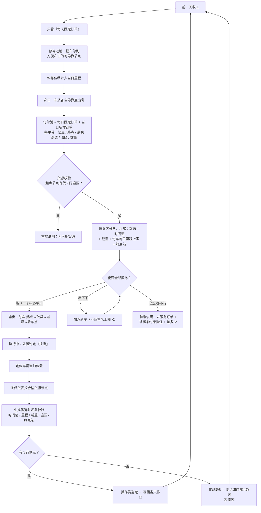

# 配送路径规划：总逻辑方案（多起点 · 里程上限 · 终点站 · 报废救援）

> 2026-09-16 编写。本文回答"这套整体逻辑在代码上能不能实现、怎么实现、哪部分该简化"，
> 并作为后续实施的**唯一入口文档**。
> 相关文档：[C_配送模块.md](C_配送模块.md) · [C_实现目标与交接.md](C_实现目标与交接.md) ·
> [接口契约.md](接口契约.md) · [singapore_network_assumptions.md](singapore_network_assumptions.md)
>
> 配图：[dispatch_master_flow.png](figures/dispatch_master_flow.png)（总逻辑流程图，可直接放进 PPT）

---

## 0. 一页速览

**结论：可行。** 而且比预想的轻——现有代码已经具备大部分机制，真正的新东西只有 5 件，
其中 4 件是"在现有模型上加维度/加字段"，只有 1 件（多起点取送）是**真正的新模型**，
但 OR-Tools 9.15 原生支持（已在本机环境验证 `RoutingModel.AddPickupAndDelivery` 可用）。

**一句话逻辑**：
> 前一天收工 → 只按"每日固定订单"决定车停哪儿 → 次日从停靠点出发 →
> 把"日常订单 + 当日新增订单"一起排线（能串就串、串不下就加车、怎么都不行就说明）→
> 途中报废 → 定位车辆 → 找合格货源节点 → 比较候选（同车取货再送／同车重排／派空车／就近停靠）→
> 收工再选址。

**可行性总表**（依据均来自仓库当前代码，非推断）：

| # | 需求 | 可行性 | 依据 / 现状 |
|---|---|---|---|
| 1 | 订单带起点与终点 | ✅ **已实现（B1b/B4，2026-09-16）** | 订单可带 `origin_facility_id`；按「温区 × 货源点」分组，**每组的路线从该货源点出发**（里程/时间窗/载重/终点站规则照旧生效）。**同一辆车串多个不同货源点**仍需完整 PDPTW——未做，见 §8.6 边界 |
| 2 | 每单最晚到达 | ✅ 已有 | `latest_min` 已进求解模型、超窗排次日 `scheduled_next_day` |
| 3 | 每车每日里程上限 | ✅ **已实现（B2，2026-09-16）** | `constraints.mileage_limit_m`：贪心在插入校验里卡、OR-Tools 用 Mileage 维度按车给容量。前端输入框仍属 B3 |
| 4 | 可作终点的节点 | ✅ **已实现（B2，2026-09-16）** | `constraints.terminal_facility_ids`：路线变**开环**，末段去最近的终点站、不再计返仓里程；`tracking`/地图同步改用该收车点。前端多选仍属 B3 |
| 5 | 车队总数（前端输入） | ✅ 已有后端 | `constraints.max_vehicles` 已贯通 planner / OR-Tools / 持久化；缺前端输入框 |
| 6 | 能串就串、否则加车 | ✅ 已有行为 | 贪心插入失败即开新车；OR-Tools 靠 capacity 维度（可选 `minimize_vehicles`）。里程进模型后语义自动成立 |
| 7 | 报废时知道车在哪 | ✅ 已有 | `tracking.vehicle_track()` 返回插值位置 + 所在 leg + fraction |
| 8 | 就近节点取货后送原终点 | ✅ 中等（新候选） | 现有候选只会"加一站"；需要 pickup→delivery **成对插入**。库存模型已有 `facility_id`（好消息） |
| 9 | 或另派一辆车 | ✅ 已有 | `spare_vehicle` 候选已在 |
| 10 | 车没活了就到就近终点站停靠 | ✅ 依赖 #4 | 需要开环路线 + 终点站集合 |
| 11 | 否则重排该车剩余订单 | ✅ 中等 | 现只会"顺路加一站"；可对"单车 + 剩余站"这个小问题重调一次求解器 |
| 12 | 怎么都超时 → 前端给说明 | ✅ **已实现（B7，2026-09-16）** | 每张未服务订单带**实测**的 `blocked_by` 与数值（需要多少 km / 超多少 / 迟到几分钟），界面逐条显示 |
| 13 | **收工后停靠选址**（你新提的第 2 条） | ✅ 可做，**全新增** | 仓库里完全没有；建议先做贪心版，别一上来做多日联合优化 |

图例：✅ 可行 · ⚠️ 需声明假设 · ❌ 不在本轮

---

## 1. 业务口径（2026-09-16 拍板，全部已确认）

| # | 口径 | 状态 | 落到代码的含义 |
|---|---|---|---|
| 1 | 里程上限**包含**返程与空驶 | ✅ | 里程维度覆盖**全部行驶**：取货前空驶 + 取货后载货 + 收工停靠位移。数字会比"只算载货"大，报告里要写明 |
| 2 | 里程上限是**每车每天**；收工时按次日固定订单预先把车停到方便的位置 | ✅ | 需要**多日状态**：车辆当日结束位置 → 次日起点。新子问题"停靠选址"（§4） |
| 3 | 次日**从哪个节点出发都可以**，停在终点站的就从该站出发 | ✅ | `DispatchVehicle.start_facility_id` 字段已存在，只需**放开校验**（现在 `validate_dispatch_inputs` 强制它等于仓库） |
| 4 | 货源在**节点**里找 | ✅ | 见"货源点结构"与 §2.3 的供货表 |
| 5 | **报废订单优先**，可延迟别的订单；但必须比较"派空车"与"同车顺带" | ✅ | 排序口径：报废订单插队，但候选仍按代价比较（沿用 `policy` 机制，不改语义） |
| 6 | 新增订单必须**同温区同车** | ✅ | 排线仍按温区分队（现有 `plan_delivery_orders` 已按 zone 独立求解），跨温区不合车 |

**货源点结构（2026-09-16 追加拍板）**：**1 个主仓（全品类）+ 2~4 个分拨点（各供一部分货物）**，
两类货源点**都从现有网络节点里选**，不新增节点。**已落地（2026-09-16）**：主仓 `W-WESTGATE`（裕廊东思家客）
+ 分拨点 `D-NORTHPOINT`（义顺）、`D-HOUGANG`（后港）、`D-BUGIS`（武吉士）；旧仓 `W-KN-PIONEER` 保留为
`third_party`（不进默认供货表）。选点依据（真实路网、168 种组合穷举）见 [供货点选址分析.md](供货点选址分析.md)。网络现为 **19 节点**（主仓 + 第三方仓 + 14 医院 + 3 分拨点）。

**补充口径**（已确认，按默认执行）：

| 项 | 定论 |
|---|---|
| 可作终点的节点 | 是**现有节点集合的子集**，由前端多选配置；车辆**末站必须落在该集合内**（"最后允许停靠的地方"） |
| 收工停靠位移 | **计入当日里程**（口径 1 含空驶） |
| 停靠选址的输入 | 只用**每天都要送的固定订单**，且该批订单**每天与前一天相同**（口径 3 ⇒ 选址输入稳定、可复算） |
| 货源可用性 vs 可发货 | 供货表只表示**有没有货**；**能不能发**仍由 A 的处置判定决定（C 不自行恢复隔离货，既有纪律） |
| 救援候选排序 | 默认 `minimize_disruption`（报废单优先插队，但候选仍按代价比较） |

---

## 2. 数据模型：要新增/改动的字段

### 2.1 订单：加"起点"

`DispatchOrderIn` / `DeliveryOrder` 增加一个字段，其余不变：

```python
origin_facility_id: str        # 新增：取货节点（订单起点）
destination_facility_id: str   # 已有：送货节点（订单终点）
earliest_min / latest_min      # 已有：收货窗（"几点之前必须送到"= latest_min）
quantity / product_id / temperature_zone / source_run_id   # 已有
```

**语义变化（关键）**：订单不再是"从仓库发货"，而是"从某个节点取货、送到另一个节点"。
求解模型从"多站送货（VRPTW）"变成"取送（PDPTW）"：每个订单 = 一对
（取货点 → 送货点），必须**同一辆车**、**先取后送**。

### 2.2 节点能力位：一个节点可以有多种身份

`network.json` 的节点现在只有 `role: depot | customer`。改为**能力位**（可并存）：

| 能力位 | 含义 | 现在的等价物 |
|---|---|---|
| `can_receive` | 可作收货点（订单终点） | `role == "customer"` |
| `can_supply` | 可作**货源点**（订单起点） | 无 |
| `can_terminate` | 可作**收车点**（车辆最后停靠） | 无 |
| `is_depot` | 主仓库 | `role == "depot"` |

这样"可作为终点停靠的节点"就是前端多选写进 `constraints.terminal_facility_ids`，
不需要改网络几何，也不影响 Solomon 回归。

### 2.3 供货表：它到底是什么（先回答"我不太明白"）

**一句话**：供货表就是一张"**哪个节点、有哪种货、有多少**"的清单。
它是"订单要带起点"这个决定的**必要配套**——因为系统必须能回答"这个起点到底有没有这货"。

**为什么非有不可（三个用它的地方）**

1. **下单时校验**：订单的起点如果是 `D-NORTHPOINT`、产品是 `frozen_m20`，
   而供货表里 `D-NORTHPOINT` 没有 `frozen_m20` → 直接拒绝并提示"该节点无此货物"（流程图里的说明①）。
   没有这张表，系统只能"相信操作员填的起点是有货的"，等于没校验。
2. **排线时**：车辆先去起点取货、再送到终点。同一辆车要服务多张订单就会跑多个起点，
   这就是"多起点取送"。供货表里的数量还决定"这个点够不够几张订单一起取"。
3. **报废救援时（最关键）**：药报废了要补发，系统必须回答
   "**哪个节点有同产品、同温区、够量的货**" → 就是查这张表。

**供货表 ≠ 库存台账（两者别混）**

| | 是什么 | 现在有没有 |
|---|---|---|
| **供货表**（本方案） | 节点级的**能力声明**："这个节点能供哪些品类、大致有多少" | ❌ 没有 |
| **库存台账**（`InventoryLotIn`） | 批次级的真实库存：`lot_id / product / facility / available_quantity / status` | ✅ 已有字段，但被锁死在单仓库 |

**建议的落地方式（一句话：能力声明 + 数量由台账聚合）**

- **能力**（静态、手写）：`can_supply` 能力位 + 该货源点供应哪些产品 —— 这是"设定"，不随库存变；
- **数量**（运行时）：
  - 有台账时 → 按 `facility + product` **聚合**台账的 `available_quantity`（真相只有一个，不会两处打架）；
  - 台账里没有（离线演示常见）→ 用供货表里手写的**演示数量**兜底，并在响应 `note` 里声明这是模拟值。

```json
{
  "W-WESTGATE":   { "role": "warehouse",    "supplies": { "vaccine_2_8": 500, "insulin_2_8": 300, "frozen_m20": 200, "mrna_ultracold": 120 } },
  "D-NORTHPOINT": { "role": "distribution", "supplies": { "vaccine_2_8": 60,  "insulin_2_8": 40 } },
  "D-HOUGANG":    { "role": "distribution", "supplies": { "vaccine_2_8": 80 } },
  "D-BUGIS":      { "role": "distribution", "supplies": { "insulin_2_8": 120 } }
}
```

上例就是拍板后的结构：**1 主仓（`role: warehouse`，全品类）+ 2~4 个分拨点
（`role: distribution`，各供一部分）**，节点全部取自现有网络节点（实际落地为 4 家思家客门店）。
按"假设 100 种货物"的规模，它就是一个 15 × 100 的矩阵（1500 格，JSON/CSV 都无压力）。

**批次与效期**（`C_配送模块.md` §5 B6 的欠账）留到后面单独一批：
v1 只做"节点 × 产品 → 可用量 + 温区"，就足以支撑取货与救援逻辑。

#### 2.3.1 产品目录与供货表怎么维护（回答"你觉得怎么样维护最好"）

**核心原则：单一来源 + 数据文件 + 测试卡死，不要把清单写进代码。**

现在的问题是**同一个产品清单硬编码了两份**（`reshipment.py:22` 的 `PRODUCT_TEMPERATURE_ZONE`
与 `daily_orders.py:33` 的镜像映射），而且各只有 4 种。扩到几十上百种时，
两处不同步就会变成"一处认得、一处不认得"的别名灾难（`接口契约.md` 明令禁止）。

建议两个文件、各有一个负责人：

| 文件 | 内容 | 谁维护 | 为什么 |
|---|---|---|---|
| `data/optimisation/product_catalog.csv` | 唯一产品目录：`product_id, name_zh, name_en, temperature_zone, unit` | **A / D**（取决于谁定药品清单） | 温区必须与 A 的处置规则、D 的图谱 `Product` 节点**同源**；C 只读 |
| `data/optimisation/supply_points.json` | 货源点声明：哪些节点是 `warehouse`/`distribution`，各供哪些产品与演示数量 | **C**（配送侧建模假设） | 属于"怎么送"的设定，随配送方案变 |

**"到底多少种货物"现在不用定**：目录是数据文件，**加一行就多一种**，代码里不出现"100"这个数字；
报告的"假设 100 种"只是规模口径，不影响实现。演示时只用到其中几种，
其余的是规模声明（写进报告即可，不要假装都送过）。

**用测试兜住维护（4 条，防止两张表打架）**：

1. 目录里每个产品都必须有 `temperature_zone`（枚举内）；
2. `supply_points.json` 里出现的每个 `product_id` 必须存在于目录（**禁别名/拼写错**）；
3. 每个分拨点的供应品类温区自洽，且**主仓覆盖全部品类**（拍板决定）；
4. 代码里**不再有第二份产品清单**——一条测试断言"温区映射来自目录"，
   防止以后又有人顺手加一份硬编码。

### 2.4 车辆：起点放开 + 当日里程台账

| 字段 | 现状 | 变更 |
|---|---|---|
| `start_facility_id` | 必须等于仓库 | **放开**：可为任意节点（口径 3） |
| 当日已行驶里程 | 无 | 新增累计量（用于"每车每天上限"跨多次改道累计） |
| 停在哪儿（次日起点） | 无 | 由"停靠选址"写回（§4） |

### 2.5 前端可输入的三项约束

`DispatchConstraintsIn` 现有 `max_vehicles` / `max_stops_per_vehicle`，新增：

```python
mileage_limit_m: Optional[int] = None            # 每车每日最长行驶里程（米）
terminal_facility_ids: Optional[List[str]] = None # 可作收车点的节点
```

前端在派单面板旁新增一组输入（车队数量 / 每车里程上限 / 可作终点的节点多选），
提交后随 `POST /api/dispatch/plan` 与 `/api/dispatch/runs` 一起下发，并在预览里回显。

---

## 3. 求解模型：从"多站送货"到"多起点取送 + 里程上限 + 开环"

### 3.1 形式化（一页说清）

**输入**
- 节点集 `N`，各自能力位 `can_receive / can_supply / can_terminate`；节点间完整距离/时间矩阵（已有，15×15 + 210 条几何）
- 供货表 `S(n, p)`：节点 `n` 上产品 `p` 的可用量
- 订单集 `O`：每单 `o = (p, qty, origin, dest, [e, l])`，要求 `S(origin, p) ≥ qty`
- 车队 `V`：每车 `(capacity, zone, start_node, onboard_spare)`；在途车另带"已完成/剩余订单 + 当前时刻位置"
- 硬约束：每车每日里程上限 `M`、系统车队上限 `K`、每车最多站点数、温区一致

**决策**：每辆车服务哪些订单、按什么顺序、在哪些节点取货、最后停在哪。

**目标（层级式，与现有指标口径一致）**

```
① 最小化未服务订单数（罚 1e6）
② 最小化用车数            （罚 1e3）
③ 最小化总行驶里程
```

> 这不是新发明的口径：现有 GA 的适应度就是 `未服务×1e6 + 车辆×1e3 + 距离`，
> `ReplanMetrics` 也已经是这套层级。所以"能串就串、否则加车"在模型里就是 ② 的自动结果。

**每车约束**
- 载重：`装载 ≤ capacity − onboard_spare`，且**取货在前、送货在后**（同一辆车）
- 时间：取货点按节点营业时间、送货点落在 `[e, l]`；超窗即不可行（或按现有规则排次日）
- 里程：`全部行驶里程 ≤ M`（含取货前空驶、载货行驶、收工停靠位移）
- 收尾：路线**末站 ∈ can_terminate 集合**，且**不回仓库**（开环）

### 3.2 OR-Tools 落地方式（已验证环境：ortools 9.15.6755）

| 需求 | 做法 | 现状 |
|---|---|---|
| 取送成对 | `routing.AddPickupAndDelivery(pickup, delivery)` + 同车 + 先取后送 | 新增 |
| 载重在取货点增加、送货点减少 | 维度回调：取货 `+qty`、送货 `−qty`，**每个节点 cumul 下界设 0**（未取货不能送） | 现有维度是"只减不增"，要改回调 |
| 里程上限 | `AddDimensionWithVehicleCapacity(distance_index, 0, [M]*n, True)`（统一上限）；复用已有的距离回调即可 | 新增 |
| 每车不同起点 | `RoutingIndexManager(num_nodes, num_vehicles, starts, ends)` 支持**每车一个起点** | 现在全车同起点（dense 0） |
| 终点站 + 不回仓 | 加一个 **dummy 终点节点**：只有 `can_terminate` 节点到它的弧代价为 0，其余给大罚分；`ends=[dummy]*n` | 现在是 `Start(v) == End(v) == 仓库`（闭回路） |
| 时间窗 | 沿用现有时间维度（服务时长、营业窗、超窗处理都已实现） | 已有 |
| 时间预算 | 沿用现有 `first_solution` / `PARALLEL_CHEAPEST_INSERTION` / GLS 配置 | 已有（含 r101 构造失败的经验） |

**要特别小心的一处**：`src/optimisation/singapore_loader.py` 现在假设"**网络节点 0 就是唯一仓库**"，
并只加载"客户 + 需求"（纯送货）。做多起点取送需要一个新的加载器
（例如 `load_pickup_delivery_subset()`），把订单展开成"取货节点 + 送货节点"两组稠密节点，
并映射回网络 id。**现有 `load_singapore_subset()` 与 Solomon 回归路径保持不动**——
那条路已跑通且有三方对比表，不能为了新功能把它弄坏。

### 3.3 贪心基线怎么改

现有贪心（`greedy.py`）是"最近邻 + 时间窗插入 + 插不进就开新车"，正是需求 6 的行为。
扩展点只有两个：**成对插入**（一次插两站、且保持"先取后送"）和**里程校验**
（插入后该车当日里程 ≤ M）。有了它，"既有快速基线、又能兜底"的结构不变，
三方对比表也能扩出一个"多起点"算例。

### 3.4 无解时给用户的说明（需求 12）

现有 `preview_emergency_order()` 已经有这个模式——库存不足时返回：

```python
{"feasible": False, "reason": "insufficient_available_inventory",
 "required_quantity": ..., "available_quantity": ..., "candidates": []}
```

按同一套结构把"排线整体不可行"补齐即可：

```json
{
  "feasible": false,
  "unserved_orders": [
    {"order_id": "RO-...", "destination": "H-NUH",
     "blocked_by": ["mileage_limit_exceeded", "time_window_infeasible"],
     "detail": {"needed_distance_m": 41800, "limit_m": 35000,
                "earliest_arrival_min": 638, "latest_min": 600}}
  ],
  "message_zh": "该订单在里程与收货时限内都无法安排：需要 41.8 km，超过单车上限 35 km；
                  最早可达 10:38，晚于最晚收货 10:00。"
}
```

前端把 `unserved_orders[].detail` 直接渲染成中文说明——这就是你要的"无论如何都会超时就告诉用户"。
**关键**：这些原因必须是**逐条约束实测出来的**（按候选试插时记录被哪条挡住），
不能写"大概是因为时限"这类猜出来的原因。

### 3.5 静态排线的完整流程（需求 6 的判定链）

```
订单池（固定 + 新增） → 校验：货源有没有货？温区对不对？车队够不够？
   ↓ 通过
按温区分队 → 每队求解（取送 + 时间窗 + 载重 + 里程上限 + 终点站）
   ↓
能否全部服务？
   ├─ 能 → 得到"每车：起点 → (取货点…送货点)… → 收车点"
   │        能串就串（用车数少），串不下就加车（上限 K 内）
   └─ 不能 → 返回未服务订单 + 被挡原因 → 前端说明 + 建议（放宽哪条约束/加车/换货源点）
```

---

## 4. 前一日收工：停靠选址（你新提的第 2 条）

这是仓库里**完全没有**的一环，也是这套逻辑里唯一"跨天"的部分。定义为**独立的小优化问题**，
放在当天配送全部结束后执行：

**输入**：次日**每日固定订单**（不含突发）、`can_terminate` 节点集合、每车当日结束位置、
每车当日剩余里程额度。
**决策**：每辆车停到哪个 `can_terminate` 节点。
**目标**：让次日更省——最小化"次日各车首段空驶距离"之和（等价于让车停在次日首个取货点附近）。
**约束**：停靠位移计入**当日**里程（口径 1）；停靠点必须在 `can_terminate` 内；温区不影响停靠点。

**三种做法，按落地成本递增**：

| 版本 | 做法 | 成本 | 建议 |
|---|---|---|---|
| v0 | 车就停在当日**末站**（若末站不可停靠，则停最近的 `can_terminate` 节点） | 极小 | 兜底 |
| **v1（推荐先做）** | 先按"次日固定订单"用现有求解器**试排一次**（车位先假定在仓库）→ 每辆车试着把停靠点改到"它次日首个取货点最近的 `can_terminate` 节点"，比较"省下的空驶 vs 花掉的停靠里程" | 小 | ✅ 先做这个 |
| v2 | 把停靠点作为决策变量，做一次小规模指派/选址优化（OR-Tools 或贪心交换） | 中 | 后面再说 |

**跨天状态**：把"某车次日从节点 X 出发"写进车辆状态（`start_facility_id`，字段已有），
次日排线直接用。这样口径 3（"从哪个节点出发都可以"）自然成立。

**一句话向别人解释**：*"今天送完不是各回各家，而是按明天的固定订单把车停在最省事的地方；
明天从停车点出发，突发订单到时候再重新规划。"*

---

## 5. 执行中：报废救援流程（需求 8~11）

**触发**：A 侧处置判定为报废（`disposition == scrap` / `reshipment_required`）→ 生成一张补发订单
（`reshipment.build_delivery_order()` 已有桥梁，现在补上 `origin` = 合格货源节点）。

**流程**：

```
① 定位：tracking.vehicle_track() → 车当前在哪条 leg、走了多少、当前时刻
② 找货：从供货表里筛出"同产品同温区、可用量 ≥ 需求"的节点集
③ 生成候选（全部要逐条校验：时间窗 / 里程 / 载重 / 温区 / 终点站）
   a. 同车 · 顺路取货再送：就近货源点取货 → 原定终点        （新增候选 rescue_pickup）
   b. 同车 · 重排剩余站序：把"取货 → 原终点"插进去，其余站重新排序
   c. 新派一辆（含空车专送）                              （已有 spare_vehicle）
   d. 该车已无其他订单 → 就近 can_terminate 节点停靠         （新增：收尾候选）
④ 比较：默认口径"最少打扰在途订单"，可切"最省运力"（已有 policy 机制）
   —— 报废订单**优先**（口径 5），但"派空车 vs 同车顺带"仍按代价比较
⑤ 可行 → 操作员选定 → 写回当天作业（幂等命令，现有状态机不动）
   不可行 → 返回原因清单 → 前端说明
```

**与现有 `dynamic_problem.py` 的差异**（都是增量，不是重写）：

| 项 | 现状 | 需要补 |
|---|---|---|
| 插入形态 | 单站插入（只加送货点） | **成对插入**：取货点 + 送货点 |
| 货源 | 固定从仓库出库 / 车上的 `onboard_spare` | 从**供货表按节点**选，可能需要"顺路去某医院取货" |
| 里程 | 只算候选距离、不是约束 | 候选必须**校验 ≤ 每车每日上限**（含已行驶） |
| 收尾 | 一律回仓库 | 停在 `can_terminate` 节点（开环） |
| 说明 | 只有库存不足一种 reason | 逐条约束的 `blocked_by` 清单 |

---

## 6. 前端要做的事

| 区域 | 现在 | 要加 |
|---|---|---|
| 派单面板 | 只显示 `constraints`（`sg-constraints` 文本） | **三个输入**：车队数量 / 每车里程上限 / 可作终点的节点（多选） |
| 排线预览 | 显示车辆数、站序、里程 | 每车显示：起点节点 → 取货点 → 送货点 → 收车点，以及**当日里程 / 上限**与是否接近上限 |
| 无解说明 | 无 | **说明块**：未服务订单 + 被哪条约束挡住 + 差多少 + 建议 |
| 报废救援 | 四类候选比较表 + 采用按钮（已有） | 加 `rescue_pickup` 与"就近停靠"两类候选；候选行显示"货源节点 / 取货后预计到达" |
| 收工停靠 | 无 | 显示"次日各车停靠点"，允许人工改（改完重算次日首段空驶） |

地图侧要同步改的是**开环收尾**：`tracking.vehicle_track()` 现在把路线写成
`route = [0, *node_sequence, 0]`（硬编码回仓），`dynamic_problem` 的 `node_sequence` 也一律以 `0` 收尾。
**这两处必须与求解器一起改**，否则会出现"求解器说停在终点站、地图把车拉回仓库"——
这个仓库已经踩过两次同类口径分裂的坑（`C_配送模块.md` §10 第 13、24 条）。

---

## 7. 哪部分可以简化（如果工期紧，按这个顺序砍）

| # | 简化 | 代价 | 报告里怎么写 |
|---|---|---|---|
| 1 | ~~起点只允许是"仓库 ∪ 少数货源点"~~ → **已拍板为正式设计**（1 主仓 + 2~4 分拨点），不做"任意节点对任意节点" | 覆盖面小，但覆盖全部实际场景（日常从仓/分拨点出货、救援从货源点取货） | 写成设计选择："货源点限定为 1 主仓 + 2~4 分拨点" |
| 2 | **"就近取货"= 在当前路段两端 ∪ 货源点里选**，不做"任意位置 → 任意节点"的最短路 | 不做全局最近，可能多几公里 | 说明为启发式简化 |
| 3 | **报废后只重排出事那辆车**（+必要时加一辆），不做全局重优化 | 可能不是全局最优，但可解释、算得快 | 明确写"局部重调度" |
| 4 | **收工停靠先做 v1（贪心）**，不做多日联合优化 | 停靠方案次优 | 明确写启发式 |
| 5 | **供货表 v1 先不含批次/效期** | 库存真实性弱 | 与 B6 一致声明 |
| 6 | **两车汇合换货（G6/G8）仍不做** | 会议目标里那条保持"待做" | 与 `C_实现目标与交接.md` §3.1 一致 |

**不建议砍的**：里程上限、终点站、无解说明。这三条是你这套逻辑的核心，
而且改动都不大（各 1~2 个文件），砍了整套逻辑就不成形了。

---

## 8. 分批实施与验收

> 每批单独提交（仓库约定 `type(scope): 中文说明`），每批都要有测试，不一次混改。

| 批次 | 内容 | 主要改动 | 验收标准 |
|---|---|---|---|
| **B1** ✅ | 产品目录单一来源 + 供货表 + 订单 `origin` | `data/optimisation/product_catalog.csv`、`data/optimisation/supply_points.json`、`catalog.py`、`schemas.py` | **已完成（2026-09-16）**：数据面见 §8.5，订单起点见 §8.6 |
| **B2** ✅ | 模型面：里程上限 + 终点站/开环 | `greedy.py`、`ortools_solver.py`、`routing.py`、`dispatch_planner.py`、`dispatch_state.py`、`tracking.py`、`service.py`、`schemas.py` | **已完成（2026-09-16）**：见 §8.1 实施记录 |
| **B3** ✅ | 前端：三个输入 + 约束回显 + 里程展示 | `ReroutePanel.vue`、`i18n/{zh,en}.js`、`stores/dispatch.js` | **已完成（2026-09-16）**：见 §8.2 实施记录 |
| **B4** ◐ | 多起点排线（分组模型 ✅；PDPTW 规划侧 ✅、执行侧待第 4 步） | `singapore_loader.load_singapore_subset(origin_facility_id=…)`、`dispatch_planner` 分组、`dispatch_models` 按货源点校验、`schemas` | **已完成（2026-09-16）**，见 §8.6；**同车多货源点**属完整 PDPTW，明确未做 |
| **B5** ✅ | 收工停靠选址（v1 贪心） | 新 `overnight.py` + `POST /api/dispatch/overnight-plan` + 前端「🌙 规划收工停靠」 | **已完成（2026-09-16）**：见 §8.3（次日从停靠点**排线**仍待 B4 的每车起点） |
| **B6** ✅ | 报废救援 | `reshipment.py`、`service.py`、`schemas.py`、`dynamic_problem.py`、`dispatch_state.py` | **已完成（2026-09-16）**：①订单随输入带 `order_id`（§8.7）②取货点＝绕路最少的货源点，取货腿进入状态/时钟/地图（§8.8）③剩余站序重排（§8.8）④**在途报废**：货还在车上时不得继续配送，在取货点一并交回并标记 `scrapped`（§8.9） |
| **B7** ✅ | 不可行理由（逐条实测）+ 前端说明块 | 新 `feasibility.py` + `plan_delivery_planner` + `ReroutePanel.vue` | **已完成（2026-09-16）**：见 §8.4 |

**B2 与 B4 是分水岭**：B2 做完，你的"里程上限 + 终点站 + 加车"逻辑就成立了；
B4 做完，"订单带起点"才真正跑起来。**建议 B1→B2→B3 先交付一版能演示的**，
B4~B7 再逐步加上。


### 8.1 B2 实施记录（2026-09-16，已完成）

**改了什么**

| 层 | 改动 |
|---|---|
| 公共调度 | `routing.evaluate_route()` 新增 `end_leg_fn`（末段去停车点，替代返仓）与 `mileage_limit`（超出即判该车不可行）；`VehicleRoute` 增加 `end_node_id` / `mileage_limit_violation`，`ReplanMetrics` 增加 `mileage_violations` |
| 贪心 | 插入校验里带上里程上限——**超限的插入直接被拒，循环自然开下一辆车**（正是"能串就串，否则加车"） |
| OR-Tools | 追加 **dummy 终点节点**（每辆车的 end 都指向它，进它的弧按"最后一个真实站点 → 最近终点站"计费）实现开环；新增 **Mileage 维度**（`AddDimensionWithVehicleCapacity`，每车容量 = 上限）把里程变成硬约束 |
| 规划器 | `DispatchConstraints` 增加 `mileage_limit_m` / `terminal_facility_ids`；规划器从网络矩阵构造 `end_leg_fn`（**网络节点号**，`restore_network_node_ids` 不再翻译它） |
| 执行侧 | `VehicleProgress.end_node_id` 随计划写入；`tracking.vehicle_track(..., end_node=)`；`dispatch_route_view` 的日程与腿改从该收车点收尾——**避免"求解器说停在终点站、地图把车拉回仓库"** |
| API | `DispatchConstraintsIn` 增加两个字段；`/api/dispatch/plan` 每条路线回 `end_node_id` / `end_facility_id` / `mileage_limit_violation`，每个温区回 `mileage_violations` / `terminal_facility_ids` |

**实测（4 家医院，从 Westgate 出发，`algorithm=greedy` 与 `ortools` 一致）**

| 场景 | 结果 |
|---|---|
| 基准（不加新约束） | 1 车 / **38.23 km** / 末站 = 仓库 |
| 开环（3 个分拨点可选） | 1 车 / **27.99 km**（省 10.2 km）/ 末站 = `D-BUGIS` |
| 里程上限 35 km | 1 车 / 4 单全服务 |
| 里程上限 **25 km** | **2 车** / 4 单全服务 / 无超限 → 自动加车 |
| 里程上限 12 km | 0 车 / 4 单全部未服务 / `feasible=false` → 明确不可行 |

**验收**：`tests/test_route_limits.py`（10 条）覆盖紧里程加车、超限不可行、终点站开环与更省里程、
两算法一致、状态机与地图跟随收车点、API 契约与参数校验；全量 `pytest -q` **217 passed / 0 failed**。
不加新约束时结果与改动前**完全一致**（向后兼容）。

**本批未做**（留给后续批次）：前端三个输入（B3）、分支/应急候选路径仍是"回仓库"口径（B6 一并处理）、
"为什么不可行"的逐条理由块（B7）。


### 8.2 B3 实施记录（2026-09-16，已完成）

**面板新增「调度约束」一组输入**（`ReroutePanel.vue`，位于今日批次预览上方）：

| 控件 | 绑定 | 作用 |
|---|---|---|
| 车队上限 | `constraints.max_vehicles` | 系统共有几辆车 |
| 每车里程上限（km） | `constraints.mileage_limit_m` | 留空 = 不限；填 30 = 每车每天 30 km |
| 每车最多站点 | `constraints.max_stops_per_vehicle` | 一辆车最多跑几个医院 |
| 可作终点站（多选） | `constraints.terminal_facility_ids` | 勾选后路线**开环**，车停在最近的那个终点站，不再开回仓库 |
| 应用并重新预览 | `dispatch.previewDailyPlan()` | 用当前约束重新算一遍（不建作业） |

**回显**：约束条显示"含空驶与收尾段 · 每车每天上限 N km · 终点站 M 个"；每条路线显示
`… → 收车于 <终点站名> · X km`（未勾选终点站时显示"回主仓"）；无法安排的订单在预览下方红字说明。

**store 层**（`stores/dispatch.js`）：新增 `constraintsForm` 与 `previewDailyPlan()`；
预览与建单统一走 `planBody()`，因此"预览看到的"和"建出来的作业"用的是同一组约束。
**操作员改过约束后，再点 🎲 换批次不会被后端默认值覆盖**（比较上次吸收的快照，有改动就保留）。

**实测（浏览器，seed=today 的 4 家医院：NTFGH / MAH / SGH / BGMP）**

| 面板设置 | 预览结果 |
|---|---|
| 不勾终点站、不限里程 | 1 车 / 54.5 km / 收车于**回主仓** |
| 45 km + 勾 3 个分拨点 | 1 车 / **42.96 km** / 收车于 **Hougang Mall** / 4 家全覆盖 |
| 30 km + 勾 3 个分拨点 | **2 车** / 53.53 km / 收车于 Bugis+（28.0 km）与 Hougang Mall（25.5 km）/ 4 家全覆盖 |
| 12 km + 勾 3 个分拨点 | 0 车 / 0 km / **红字："有 4 张订单在里程/时间窗内无法安排（未服务）。"** |

**执行侧一致**：点「确认该计划并建立配送作业」后，`GET /api/dispatch/active` 里该车
`end_node_id = 17`（后港店），路线**末段是 12 → 17 而不是回仓库 0**，`still_returning = 1`，
且执行里程 42.96 km 与预览完全相同——模型、预览、执行三处口径一致。

**i18n**：中英各新增 13 个词条（`dailyLimits` / `dailyMileageCap` / `dailyTerminals` / `dailyApply` /
`dailyEndsAt` / `dailyUnserved` / `dailyOverLimit` 等）。


### 8.3 B5 实施记录（2026-09-16，已完成）

**新增** `src/optimisation/overnight.py` + `POST /api/dispatch/overnight-plan`（只读，不占资源）：

1. 用**次日固定订单**试排一次（v1 假设车都在主仓），得到每辆车次日的**首站**；
2. 在 `constraints.terminal_facility_ids` 里选"离首站最近"的节点作为过夜点；
3. 把开过去的**位移计入当日里程上限**（`today_distance_m` + `mileage_limit_m`），预算不够就原地不动；
4. 回报 `saved_m`（次日首段少跑多少）与 **`net_two_day_m`**（两日净额）。

**如实声明的一条**（写进了响应的 `assumptions`）：按三角不等式，停靠位移**通常不小于**次日省下的首段空驶，
所以这项决策买到的是**次日更短的首段与更早出发**，不是两日总里程更省。第一版我把它做成了一个
`worth_moving` 布尔并在界面上当"划算"讲——**那是错的**，已改成如实的 `net_two_day_m`（负值=两日总里程略增）。

**界面实测**（`?api=…` 页面，车队当日从 Westgate 出发、收工停在后港）：

| 当日里程上限 | 结果 |
|---|---|
| 45 km（当日已跑 42.96，剩约 2 km） | 想去武吉士（14.8 km，比后港 22.2 km 近），**预算不够** → 原地不动，并注明"当日里程不够开过去" |
| 60 km | **移到武吉士**，位移 10.9 km，次日首段省 7.4 km，两日净 −3.5 km |

**顺手修掉一个不合理**：首版让"次日无任务"的车也开 17.7 km 去停在最近的分拨点——纯浪费。
现在闲置车一律原地不动（有回归测试）。

**已知边界**：次日**排线**仍从主仓起算（求解器只支持单一 depot）；"从停靠点出发"需要每车起点支持，
与 B4 的多起点一起做。本批产出并回报该决定，界面里已把次日首站与省下的里程摆出来。

### 8.4 B7 实施记录（2026-09-16，已完成）

**新增** `src/optimisation/feasibility.py`：对每张未服务订单，**真的**把它插入每条现有路线（以及一辆空车，
若车队还有余量），用与求解器同一个 `evaluate_route` 判定，然后记录**挡在哪一条**：

| code | 含义 | 带的数值 |
|---|---|---|
| `mileage_limit_exceeded` | 里程上限不够 | `needed_distance_m` / `limit_m`（取**最接近可行**的那次尝试） |
| `time_window_infeasible` | 会晚于收货窗 | `earliest_arrival_min` / `latest_min` / `late_by_min` |
| `capacity_exceeded` | 载重不够 | `needed_units` / `capacity_units` |
| `closing_window_exceeded` | 赶不到收车点/仓库关门 | `closing_min` |
| `stop_limit_exceeded` | 每车最多站点已满 | `max_stops_per_vehicle` |
| `no_vehicle_available` | 没有可用车 | — |
| `placeable_in_isolation` | 单独/换个位置放得下（求解器没找到） | `fits_after_distance_m` |

代码是稳定标识符，**中文措辞在前端**（与判定 code 一样的纪律）。响应里每张未服务订单带
`facility_id` / `order_ids` / `reasons`，界面逐条渲染。

**界面实测**：45 km 上限下不勾终点站时，预览给出
"有 3 张订单在里程/时间窗内无法安排（未服务）。"并在下面逐条列出
"Singapore General Hospital 需要 28.8 km，超过单车上限 26.0 km"这类**实测**差额。

**注意**：本模块的成本是 O(未服务数 × 路线数 × 位置数) 次路线评估，规模等于一次排线；
只在有未服务订单时触发。


### 8.5 B1 实施记录（2026-09-16）：产品目录与供货表已落地

**先说一个决定**：产品从"设想的 100 种"收敛为 **4 种**。原因不是懒——**路径规划不能发明
规则引擎判不了的产品**：权威清单在 A 的 `src/rule_engine/rules_config.json`（4 个产品，
阈值有条款级出处，见 `docs/阈值证据表_v1.md`）。100 种要成立，得先有 100 份阈值出处。
现在目录与 A 的清单**逐字相同**，并由测试断言"两边必须一模一样"。

**两个文件**

| 文件 | 用途 | 谁维护 |
|---|---|---|
| `data/optimisation/product_catalog.csv` | `product_id → 温区` 的**唯一来源**（原先硬编码在 `reshipment.py` 与 `daily_orders.py` 两处） | A 或 D（温区须与 A 的规则、D 的图谱同源） |
| `data/optimisation/supply_points.json` | 哪个节点能供哪些货、演示可用量 | C |

`product_catalog.csv` 列：`product_id, name_zh, name_en, temperature_zone, unit`。
**不写**任何阈值（`storage_min_c` / `mkt_threshold_c` / `retestable` / `freeze_sensitive` 都在 A 那边）——
复制一份就是两处漂移的开始。温区只允许 `chilled / frozen / ultracold`。

`supply_points.json` 结构：`points[]` = `{facility_id, kind: warehouse|distribution, supplies}`，
主仓用 `supplies: "all"` + `demo_quantity`。

**实际分配（主仓全品类，分拨点每点最多 2 类）**

| 节点 | 类型 | 供货 |
|---|---|---|
| `W-WESTGATE`（裕廊东） | 主仓 | 全部 4 种（疫苗 600 / 胰岛素 400 / 冷冻 300 / mRNA 200） |
| `D-NORTHPOINT`（义顺） | 分拨 | 疫苗 90 · 冷冻 60 |
| `D-HOUGANG`（后港） | 分拨 | 疫苗 90 · mRNA 40 |
| `D-BUGIS`（武吉士） | 分拨 | 胰岛素 120 · 冷冻 60 |

配额思路：**疫苗**是主力（冷藏、医院订单默认货），放在北部与东北两个点；**冷冻**放北部与南部；
**mRNA（超低温）**只在东北；**胰岛素**只在南部——每个品种至少有一个分拨点能供，
同时保留"不是每个点都有每种货"这一事实，让"去哪个点取货"成为真问题。
`W-KN-PIONEER`（第三方仓）**故意不列入**，仅作对照。

**校验（写进代码，错了直接报错，不静默）**：主仓恰好一个且覆盖全品类；`facility_id` 必须存在于
`network.json` 且 `role` 与 `kind` 匹配（`depot`↔`warehouse`、`distribution`↔`distribution`）；
每个 `product_id` 必须在目录里；每个分拨点**最多 2 类**；数量为非负整数；
**不在表里 = 不能供货**（所以医院不必出现）。

**可用量口径**：有批次台账时按 `facility + product` **聚合台账**为准（真的 0 就是没货，
不会被演示值掩盖）；台账里没有这一对时才用文件里的演示值兜底，并由调用方声明是模拟值。

**顺手清掉的重复**：`reshipment.PRODUCT_TEMPERATURE_ZONE` 与 `daily_orders.ZONE_PRODUCT`
现在都从目录派生（后者取"每温区的第一行"作为代表产品），派生结果与原来的硬编码**完全一致**，
测试里用 golden 值钉住。

**仍然待做（B1b）**：订单的 `origin_facility_id` 字段与"起点了就必须能供这个货"的校验；
以及与 B4 的多起点排线接起来。**在此之前系统行为完全不变**（向后兼容）。


### 8.6 B1b + B4 实施记录（2026-09-16）：订单带起点，路线从货源点出发

**实现的模型**：订单可带 `origin_facility_id`（不给＝默认主仓）。规划器按 **（温区 × 货源点）** 分组，
每组把该货源点当作**该组的出发仓**（`load_singapore_subset(origin_facility_id=…)`），
于是"去哪个点取货"成为路线的真实起点：里程上限、时间窗、载重、终点站全部作用在**真正会发生的那段路**上。

**为什么这样做**：这是"订单带起点"最短的诚实实现路径——复用了已经验证过的单车场求解链路，
不引入新的求解模型，风险可控；而且它与 B5 天然闭环（昨晚停在分拨点的车，次日照样从那组出发）。

| 改动 | 位置 |
|---|---|
| 订单新增 `origin_facility_id`（可选） | `dispatch_models.DeliveryOrder`、`api/schemas.DispatchOrderIn`、`service._order_dump` |
| 按货源点分别校验库存与车辆 | `dispatch_models.validate_dispatch_inputs`（可给"某货源点没有这批货/没有车"的具体报错） |
| 起点必须是**供货点且能供这个货** | `dispatch_planner._assert_origins_can_supply`（读供货表；医院永远不能当起点） |
| 分组求解 + 组内从货源点出发 | `dispatch_planner.plan_delivery_orders`、`ZonePlan.origin_facility_id` |
| 组内任意节点当仓 | `singapore_loader.load_singapore_subset(origin_facility_id=…)` |
| 计划响应回显每组货源点 | `service.dispatch_plan_view`（`zones[].origin_facility_id`）；前端显示"从 X 取货" |
| 停靠选址改看**取货点** | `overnight.py`：车明天必须先到取货点，所以停靠要靠近它（字段改名 `tomorrow_origin_facility_id`） |

**实测**：同一批订单里主仓一张、后港一张 → 两个组、各自一台车、各自从自己的货源点出发；
后港取货送竹脚医院 **20.85 km**，同一单改从主仓出发 **28.8 km** —— 起点确实改变了路线。

**明确未做（边界，别当成已完成）**：**同一辆车一天串多个不同货源点的订单**。
那需要真正的取送（PDPTW）模型：同一插单单元含"取货点 + 送货点"、容量在取货时增加在送货时减少、
先取后送同车。OR-Tools 9.15 有 `AddPickupAndDelivery`（已在本机验证可用），
接入它要动 `evaluate_route` 的载重剖面、`RouteStop` 语义、状态机的订单序列与前端腿的生成，
是一次跨 8 个以上文件的重构。

> **2026-09-16 进展**：**规划侧已实现（PDPTW 步骤 1–3，见 §8.10）**，
> 以 `constraints.routing_model="pickup_delivery"` 开关启用（默认仍是分组的 `"grouped"`）：
> 一辆车可以沿途从多个货源点取货再送。**执行侧与贪心基线属第 4 步**——
> 状态机目前只支持"队首取货"，因此取送计划**建单会被显式拒绝**，不会画出车没走的路线。

**顺带**：`zone_products()` 让每日批次的产品仍来自目录；`overnight.py` 的口径随之更准
（停车目标是取货点而不是首个送货点），B5 的测试与文案已同步。


### 8.7 B6 第一半（2026-09-16）：报废救援接上"属于哪张订单"

**用户的更正**（本文档记录，因为它否掉了我先前的一个判断）：我原先写"彻底解决需 A 侧
`ExcursionEvent` 承载批次与收货方"。核对代码后确认**这话说满了**——运行状态里
`assignments[order_id] → vehicle_id` 与 `reservations[order_id] → lot 分配` **本来就有**
"订单 → 车 → 批次"的链路；缺的只是那把钥匙（订单 id）。而用户指出：**输入本身就是我们自己
模拟的，这把钥匙应该随输入一起来**，不该让人在界面上选，更不必等 A。

**口径澄清（用户）**：报废默认是**整单全损**，不区分坏了几箱——所以"补发多少"就等于
"该订单载了多少"，不需要批次级台账。

**实现**：`EventIn` 新增可选 `order_id`；`service._linked_order()` 从进行中的作业里解析它；
`build_delivery_order(record, linked_order=…)` 于是取该订单的产品、收货医院与数量。
同时保留旧路径（不给 `order_id` 时仍用 `event.destination_facility_id` + 节点 demand），
并在响应里用 `order_source ∈ {linked_order, event_fallback}` 标明字段到底来自哪儿。
顺带修好错误优先级：`reshipment_required=false` 的案子先报"不需要补发"，
不会被"没有进行中的作业"掩盖（这条是改顺序时踩出来的，测试已钉住）。

**接上之后不再靠猜的东西**：收货医院（`destination_facility_id` —— 结案表单那个下拉框可以退休了）、
补发数量（该订单的 quantity）、在哪辆车上（`assignments`）、涉及哪些批次（`reservations`）。

**仍未做**：① 取货点改为"最近的、有货的货源点"（`dynamic_problem` 仍有 4 处假定 `DISPATCH_ORIGIN`）；
② 出事车辆剩余站序重排；③ "货还在车上"（`stage=transit`）那一支需要的车辆载货建模。


### 8.8 B6 余下两项（2026-09-16）：就近取货点 + 剩余站序重排

**② 取货点改为"绕路最少的货源点"**。原先四类候选都从主仓取货（`DISPATCH_ORIGIN` 写死在 4 处）。
现在：候选构造时先从**供货表 × 请求台账**求出"能供这个产品且确实有货"的货源点集合——
**供货表给许可，台账给事实，两者都要满足**（表里的演示数量不算库存）——再按
`从车当前位置去该点 + 从该点到医院` **两段之和**最小来选。

> 一开始我按"离车最近"选，实测发现会绕远：从主仓出发时，经主仓 25.10 km、经后港 25.51 km，
> 而"离车最近"与"绕路最少"不是一回事。改成整段绕路最小后，从 H-NUH 出发时后港（21.5 km）
> 完胜主仓（32.9 km）。

**取货腿是真实工作量，所以它同时进入三处**（否则就是又一次"两处口径不一致"）：

| 位置 | 改动 |
|---|---|
| 状态 | `VehicleProgress.pickup_facility_ids`：车辆在送货前要先去的货源点 |
| 时钟 | `tick` 的序列把取货点放在最前，并在"是否该落账送达"里**扣掉**它们（否则车刚到取货点就会把第一单记成已送达） |
| 地图 | `dispatch_route_view` 把取货点作为 `kind: "pickup"` 的一站画在最前 |

接受候选时，**批次在候选选定的货源点预留**（不再固定主仓），并把该点写进车辆状态。

**③ 出事车剩余站序重排**。插入救援单后，原来剩余订单的顺序原封不动，新站落在哪儿决定了车要多绕多少。
现在是**有界 2-opt**，硬规则只有一条：**只能接受"不让任何原本准时的订单变成迟到"的交换**
（已经迟到的订单保持迟到——那是操作员已经面对的局面，不是否决理由）。
重排结果写进候选（`remaining_order_ids_after` / `resequenced`），
**接受时按候选预览的队列落库**，保证"跑的计划"就是"比较过的计划"。

**实测**（`tests/test_rescue_pickup.py` / `tests/test_rescue_resequence.py`）：
交叉队列 `START→A→C→B`(26) 被理顺为 `START→C→A→B`(15)；会让准时单迟到的交换被拒绝；
候选的取货点与预留批次一致；接受后地图首站是取货点、时钟不会提前落账。

**仍未做**：`stage=transit`（货还在车上）那一支——车上的报废货如何处置、剩余订单是否交接，
需要"车辆当前载了什么"的建模。当前实现覆盖的是"货已在收货点"的演示主线。


### 8.9 B6 最后一块（2026-09-16）：货还在车上

**怎么判断**：不需要新数据——关联订单若仍在某辆车的 `remaining_order_ids` 里，货就**还在车上**；
若已进入 `delivered_order_ids`，货**已在收货点**（也就是我们此前的演示主线）。这个分叉由状态直接给出。

**报废货怎么处置**：**在取货点一并交回**。冷链现实就是"交回报废批次、同时领取替换货"，所以
不需要为处置单独加一条腿——`pickup_facility_id` 那一站同时承担两件事，候选里用
`quarantine_order_ids` 标明"这一方案要在那儿交出哪张单"。
（`add_stop_in_transit` 用车上余货、不设停靠点，因此它不交回任何东西——这条写进了
响应的 `limitations`，不是默默忽略。）

**不得继续配送**：接受方案时把该订单从车辆队列中**摘出**并置为 `scrapped`。
摘出而不是标成"已送达"很重要——时钟是按"这辆车还要送几单"算到达的，留着它会把报废货记成送达。
`scrapped` 是终态：既不是待送也不是已送达，审计链两头都留着。

**只对在车上的货报废**：已经送达的订单**保持 delivered**——它确实交付过，
改写它会抹掉"为什么要补发"这个事实。（这条是我实现时踩出来的：第一版把已送达的单也标成了报废，
测试直接抓住。）

**顺带修的边界**：如果报废的是这辆车**最后一单**，车不能从地图上消失——
`dispatch_route_view` 原先"没有任何站点就不返回这辆车"，现在只要它还有转向停靠点或收车点就仍然返回，
它会开去停靠点收工。实时指标也新增 `orders_scrapped`，否则报废单在界面上无处可见。


### 8.10 PDPTW 步骤 1–3（2026-09-16，规划侧完成，默认关闭）

**为什么分步**：这是全项目最大的一次改动，且它会**取代**一个当时能跑通、289 条测试全绿的模型。
所以做成**开关**（`constraints.routing_model`，默认 `grouped`），任何一步出问题都能退回。

**第 1 步 · 核心有符号载重 + 配对校验**（`models.py` / `routing.py`）
- `Node.kind`（`delivery`/`pickup`）与 `pair_id`；`SolomonInstance.load_model`（`preloaded` 默认 / `pickup_delivery`）。
- `evaluate_route`：取送模式下**取货加、送货减**；容量违规按**峰值**而非终载判
  （一辆车可以中途超载再卸下来——只看终载会漏掉）；`pairing_violation` 捕获"先送后取"。
- `customer_ids` 仍只算**送货点**（＝订单数）；新增 `node_sequence` 属性给出**完整行驶序列**。
- **老行为逐字节不变**：`preloaded` 分支就是原来的代码，既有 300+ 条测试即证据。

**第 2 步 · 按订单建节点的加载器**（`load_pickup_delivery_subset`）
- 每张订单贡献**两个稠密节点**：起点（`kind="pickup"`）与终点（`kind="delivery"`），`pair_id` 相同。
- **需求一律存正数，符号由 `kind` 决定**——让 `Node.demand` 在两种角色下都表示"多少"。
  （第一版给送货点写了负需求，与调度核心的约定冲突，靠测试才发现。）
- 稠密编号按 `order_id` 排序分配 ⇒ **同一请求永远得到同一实例**（结果可复现）。

**第 3 步 · OR-Tools 取送 + 规划器开关**
- `AddPickupAndDelivery` + 同车/先后约束 + **载重下界 0**（禁止"没取就送"靠负载重蒙混）；
  `drop_penalty` 改为**成对放弃**；首解策略在取送模式下改用 `PARALLEL_CHEAPEST_INSERTION`
  （默认策略在这类实例上构造不出可行首解，与 §5 A2 同类问题）。
- 规划器：取送模式**不再按货源点分组**，一个温区一个实例；车辆校验放宽为"本温区有车"
  （货源点校验仍逐单生效）。`diagnose_unserved` 改为**成对插入诊断**——
  单点插入在这里没有意义，会把配对失败误报成里程/时间窗问题。
- **实测**：一车从主仓取两单、后港取一单，送三家医院，收车于后港；
  行驶序列 `W-WESTGATE → W-WESTGATE → H-NUH → H-SGH → D-HOUGANG → H-SKH`，
  载重 `30 → 55 → 30 → 0 → 20 → 0`，`feasible=true`。**这是分组模型做不到的。**

**第 4 步**（见 §8.11，已完成）。

---

### 8.11 PDPTW 步骤 4（2026-09-16，已完成）：取送计划从"能算"到"能建单执行"

第 1–3 步只做到"能算出计划"。计划不能执行就是张图，所以这一步的目标是
**预览 → 建单 → 发车 → 时钟推进 → 地图**全程自洽。四件事：

**① 执行层改用"行驶序列"描述车辆工作**（`dispatch_state.py` / `service.py`）
- 新增 `PlannedStop(kind, order_id, facility_id)` 与 `VehicleProgress.drive_plan`：
  **整条行驶序列**（取货＋送货，含已完成的站，永不裁剪）。为空时退回老口径
  "队首取货 + 订单队列"，所以分组模型与 B6 救援的代码路径**逐字未动**。
- 关键设计：**没有新增"走到第几站"的指针**。已送达订单数 + 计划本身就是位置——
  `next_stop()` 返回 `(计划下标, 站点)`：第 n 个送货点前面的取货点必然是**已经开过**的。
  到期判定因此是 `track["reached_stops"] > 下标`，对分组路线**恰好等于**从前的
  `reached - 取货数 > 已送达数`。这是"能加而不改老行为"的原因，测试把这个等式钉住了。
- `accept_plan` 去掉拒绝守卫，改为建 `drive_plan`；`state_to_dict`/`state_from_dict` 让它
  以纯数据形态随 run 持久化（否则响应会因为 `PlannedStop` 不可 JSON 序列化而 500）。
- 顺手修掉一处**同源口径不一致**：`accept_plan` 只从主仓扣库存，而多货源计划的货就在
  分拨点。改为按**订单自己的起点**扣（`origin_facility_id or DISPATCH_ORIGIN`），
  与 `validate_dispatch_inputs` 的逐单校验一致。

**② 一个潜伏很久的真 bug：站点落在仓库节点上时不被计数**
- `vehicle_track` 原来用"这段路的终点不是仓库"来判断"这是一个站"。在分组模型里
  客户永远不是仓库，所以一直等价；但取送模式下**取货点常常就是主仓本身**
  （节点 0 既是路线起点又是取货点），于是该站被静默漏计，时钟据此投递了**错误的订单**
  （实测：跑完整条路线只送出 1 单）。
- 改为按**下标**判断（前 `len(node_sequence)` 段路各自终点就是一个站），
  顺带修正"车停到停车场也算一次服务时间"的小偏差。`arrivals` 现在恒等于站点数，
  与既有断言 `len(arrivals) == len(sequence)` 一致且更强。

**③ 贪心基线补齐成对插入**（`greedy.py`）
- `_best_feasible_pair_insertion`：一次插入**一整对**，枚举 `(i, j)`（`i <= j`）——
  取货放 `i`、送货放 `j`，覆盖"紧接着送""最后送"和中间所有插法；候选**整条重新排程**，
  容量按峰值判（核心早已如此，贪心这里必须跟上）。
- 由此发现并修掉一个自己写的 bug：`ids` 曾用 `route.customer_ids`（取送模式下**只有送货点**）
  继续下一轮插入，等于让第二对货"没人取就送"，于是每次只能服务 1 单。改为
  `route.node_sequence`（完整序列）。实测与 OR-Tools 在这组数据上得到**同一条路线**
  （`58.64 km`，峰值载重 75/100）。
- `_plan_pickup_delivery` 现在接受 `greedy` 与 `ortools`，计划名分别为
  `greedy-pair-insertion-pickup-delivery` / `ortools-pickup-delivery`。

**④ GA 的边界写清楚**（`ga_solver.py` / `dispatch_planner.py`）
- 遗传算法进化的是**单起点**巨tour，隐含"装好出发"；取送实例既多起点又有升有降的载重，
  一个排列根本描述不了解，更谈不上优劣。因此：
  - `solve_ga` 对 `load_model="pickup_delivery"` **显式拒绝**（保护直接调用它的脚本）；
  - 调度侧的算法白名单给出原因，而不是"悄悄换一个求解器"。
- 声明口径：**GA 只覆盖单起点、货在起点上车的模型**；多货源请用 OR-Tools 或贪心成对插入。

**⑤ 前端**（`ReroutePanel.vue` / `stores/dispatch.js` / i18n）
- 「调度约束」新增**配送模型**下拉：`grouped` / `pickup_delivery`，随 `planBody` 一起提交。
- 站点条与详情面板按 `kind` 区分：取货站虚线边框 + `↑取货`；详情写明"该站只装货不交货"。
- 每日路线行改为按 `stops` 渲染（`↑W-WESTGATE → H-NUH → ↑D-HOUGANG → H-SKH`）；
  取送模式没有统一起点，行首改为"沿途取货"而不是显示一个不存在的起点。
- 后端顺带把 `zones[].routing_model` 和每个 stop 的 `kind`（含送货站）补进契约，
  前端据此说话而不是猜。

**⑥ 明确不做的（写进报告）**：**取送作业上不接报废救援**。
救援的每一种方案都是"把新订单插到某辆车**订单队列**的队首，再重排队尾"，
而取送作业开的是显式**站点序列**；只改队列会让新订单挂在一辆永远不会开到它那里的车上——
台账和地图会从此不一致。所以两个入口（预览与接受）**一起拒绝**并说明出路
（把当天批次按 `grouped` 重排），而不是"预览能选、接受才报错"或"接受后悄悄丢单"。

**验收**：`pytest` 全绿（详见 §9 数字），`pnpm build` 通过；
接口级测试真的建单、发车、推进时钟，并断言"送货顺序＝计划顺序、没取货就不送"。

---

### 8.12 扰动前后对比出图（2026-09-18，`docs/C_配送模块.md` §4.3 第三层）

**做的事**：把"改道前 vs 改道后"从**界面上的实时效果**变成**报告里可引用的一张静态图**。


配图：[dispatch_disruption_comparison.png](figures/dispatch_disruption_comparison.png)（矢量版同名 `.svg`）。

**生成方式**：`python scripts/plot_disruption_comparison.py`。它**驱动真实 API** 走一遍操作员会走的顺序——
出今日批次 → 建作业 → 发车 → 推进模拟时钟 → 结案一个**挂到在途订单上**的报废案例 → 取支线预览——
然后把后端返回的东西原样画出（`baselines[vehicle].route_geojson` 是"改道前"，
每个候选自己的 `route_geojson` 是"改道后"，`added_distance_m` 与 `affected_orders[].delay_min` 是多跑多少与被拖迟多少）。
**"改道前"那条线从车当前位置起算**，不是从仓库起——要比较的是它**前面还没干的活**。

**一次实测**（5 家医院、车已发出、在 KTPH 还剩两站时报废一单疫苗）：

| 方案 | 多跑 | 受影响订单 | 最多迟到 |
|---|---|---|---|
| 在途余货顺路加一站（`add_stop_in_transit`） | **+0.0 km** | 2 单 | 0 min |
| 返仓取货（`return_to_depot`） | **+22.6 km** | 2 单 | **33.5 min** |

图上就是"一条绕回仓库的回头线"与它换来的半小时延误——这正是 §4.2 那套候选比较器存在的理由。

**为什么不是"看图说话"**：数据契约由 `tests/test_disruption_figure.py`（4 条）钉住——
在途车队**真的会给出多个方案**、"改道前"**从车当前位置起**、每个候选的 `added_distance_m`
**等于**由提交路网重算的序列差、连带延误**归属到真实订单**。任何一条退化，图还是照画，所以要在测试里拦。

**该报的口径**：里程为路网静态距离、含空驶与收尾段；受影响订单 ETA 不计每站装卸停留；
报案时刻决定车在哪，换一个时刻**拓扑相同、数字略变**（这就是"扰动"）。两次独立运行数字一致（已实测）。

---

## 9. 风险与已知偏差（报告必须写）
1. **PDPTW 比 VRPTW 难解**：取送约束会让"构造首解"更容易失败——本仓库已经在 r101/rc101 上
   踩过"默认首解策略构造不出解"的坑（`C_配送模块.md` §5 A2）。对策：保留贪心基线、
   明确输出"未服务订单"，不把"求解器没返回"当成"无解"。
2. **"医院供货"是假设**：本方案把它表述为"主仓 + 区域分拨点"，并在报告里声明为模拟设定。
3. **里程口径含空驶**：加了这个约束后，可行方案会明显变少、里程数字变大，
   报告里要解释"为什么比只算载货大"。
4. **100 种货物是跨成员工作**：产品目录、温区映射、KG `Product` 节点与规则映射要一起扩，
   否则会出现"C 认得的货物、图谱里没有"的别名问题。
5. **多日状态**：停靠选址引入了跨天状态，演示前要保证昨天的车辆状态是干净的
   （否则"车内还有旧订单"会让次日排线报错）。

---

## 10. 仍然开放的事项（口径已全部确认，剩下的是选点与归属）

> 2026-09-16：原 6 条待确认口径**已全部确认**，定论写入 §1。
> 下面只剩"要拍板的具体取值"和"跨成员归属"，都不阻塞 B1 开工。

| # | 事项 | 现状 / 建议 | 需要谁定 |
|---|---|---|---|
| 1 | **具体选哪 2~4 个分拨点** | 建议按"三大片区各一个"选，且尽量落在将来会用到的大医院（如 SGH / NUH / 东部一家）；要避开与主仓过近的点 | C 提候选，你拍板 |
| 2 | **产品目录的最终数量与负责人** | 数量不用现在定（数据文件，加行即可，"100 种"只作报告口径）；维护人建议 **A 或 D**——因为温区必须与 A 的规则、D 的图谱同源 | 你指定一人 |
| 3 | **货源数量用"手写演示值"还是"台账聚合"** | 建议：能力声明 + **有台账时按台账聚合**，没有时用供货表演示值兜底并在 `note` 声明（见 §2.3） | C 实现，若要与 A 的真实库存打通再谈 |
| 4 | **图谱 Product 节点是否跟着目录一起扩** | 图谱现在只有 4 个 Product 节点；若目录扩到几十上百种，**必须同源**，否则 C 认得的货物图谱里没有（属 D 的工作区） | D（你） |
| 5 | ~~可作终点的节点~~ | ✅ 已定：现有节点子集，前端多选，末站必须落在其中 | — |
| 6 | ~~停靠位移是否计入当日里程~~ | ✅ 已定：计入 | — |
| 7 | ~~次日固定订单是否与今天相同~~ | ✅ 已定：**每天相同**（选址输入稳定） | — |
| 8 | ~~新建节点作为货源点/终点站~~ | ✅ 已定并落地：全部取自现有网络节点（19 节点：主仓 `W-WESTGATE` + 3 分拨点），不新建节点 | — |

---

## 附：总逻辑流程图

见 [figures/dispatch_master_flow.png](figures/dispatch_master_flow.png)（矢量版同名 `.svg`）。
下面同一张图的 Mermaid 版，便于在支持 Mermaid 的编辑器里直接看：


