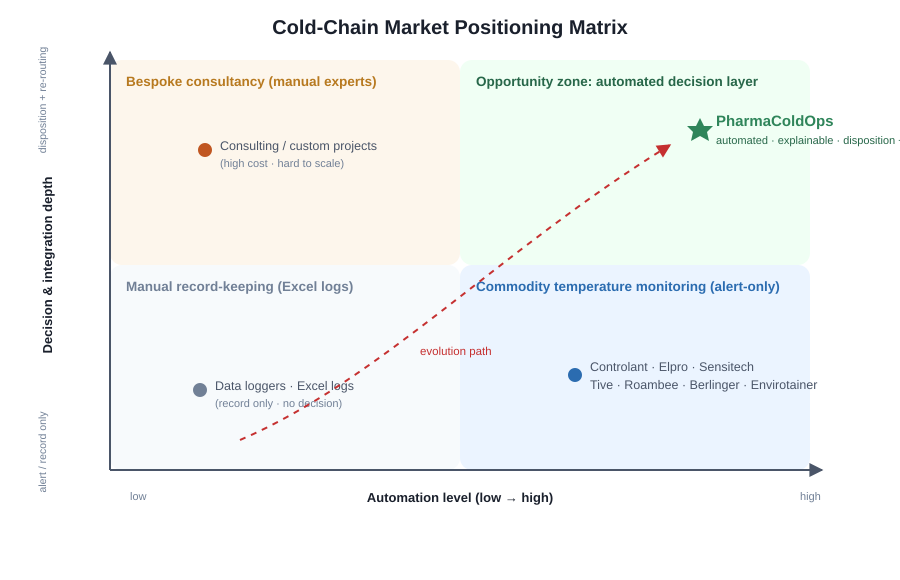
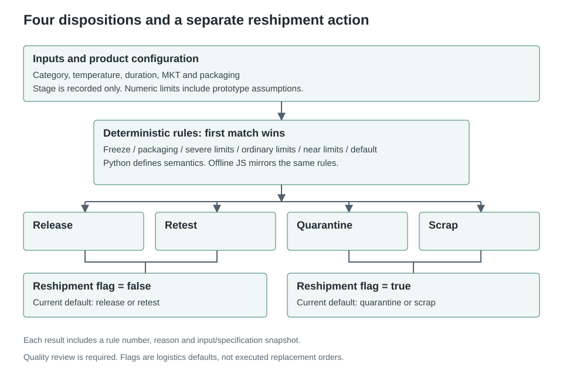
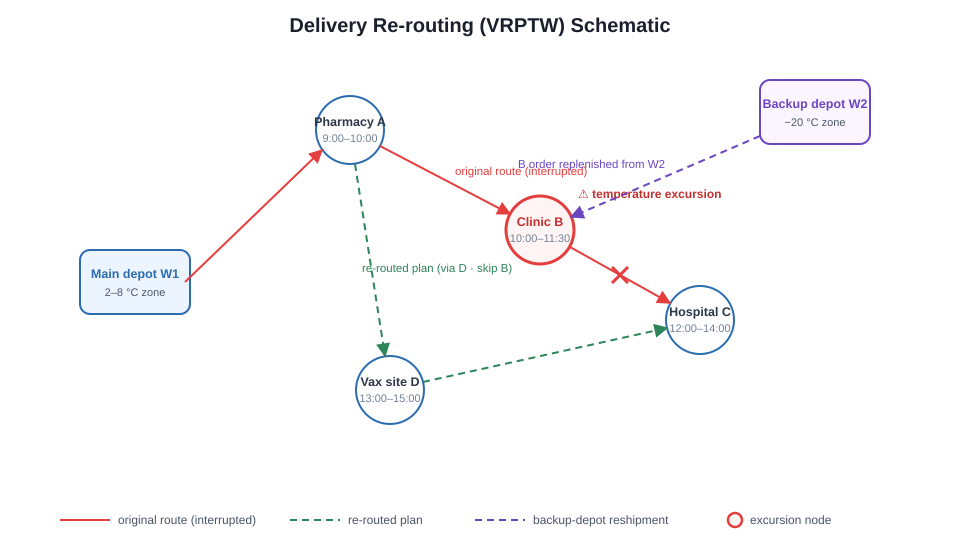
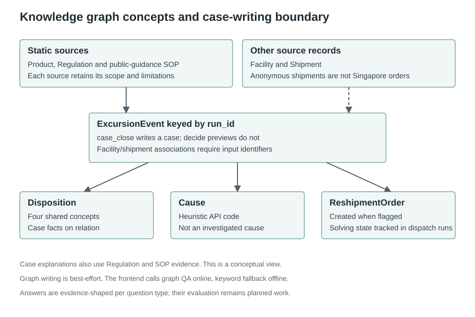
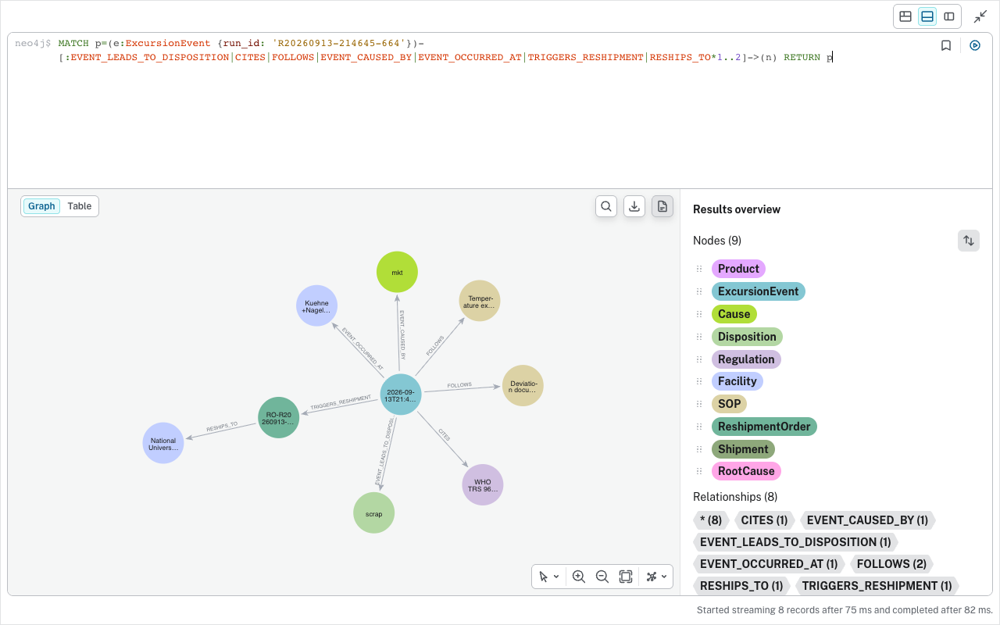
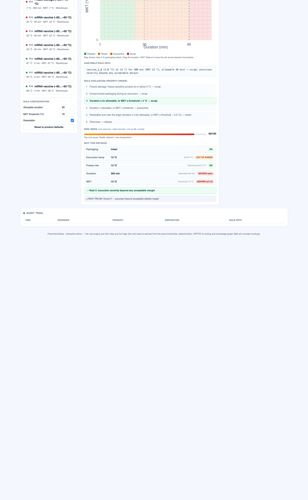
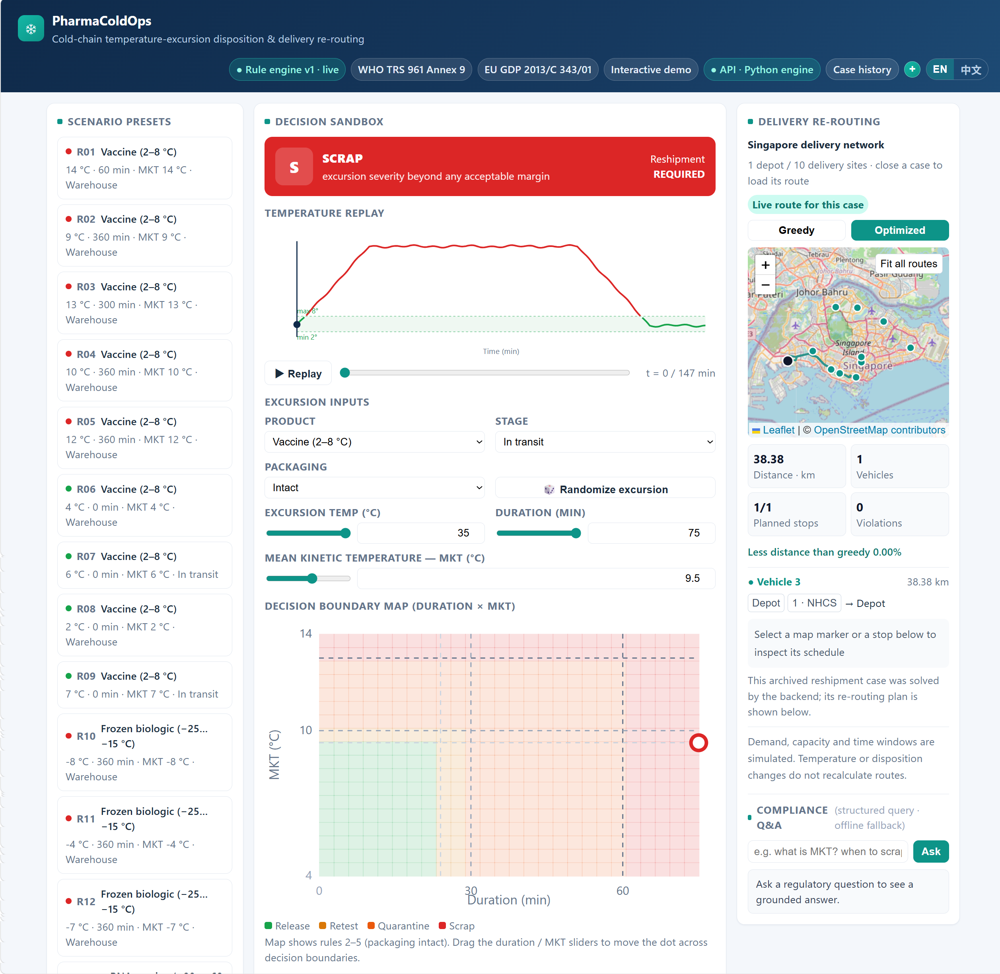
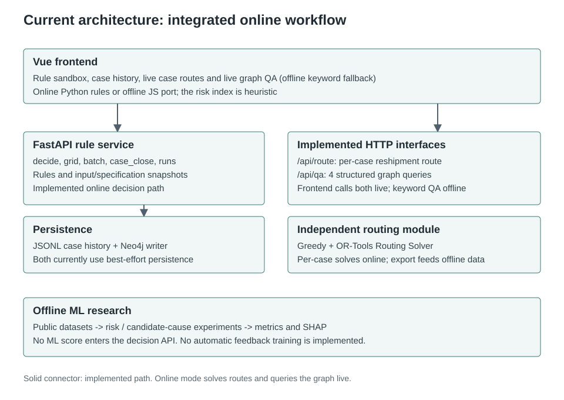
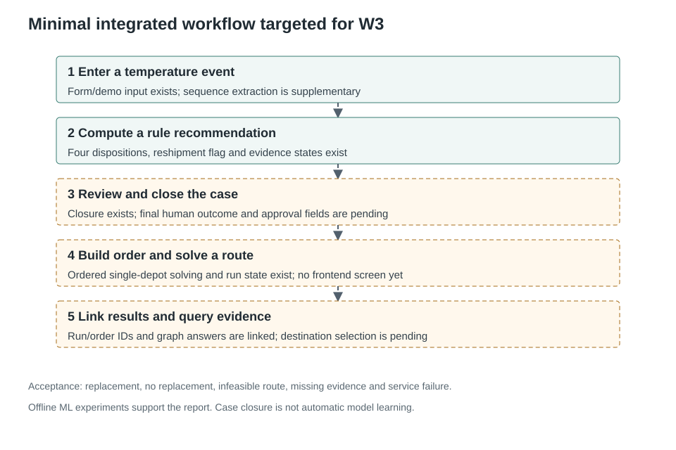

# PharmaColdOps
## Decision Support for Cold Chain Pharmaceutical Excursions and Delivery Replanning

Course: IRS Practice Module

Group name: Project Group 52

Members: Xu Wenzhe (A0328771W), Zhu Jianyu (A0353769L), Wang Lepeng (A0357864L), Shen Ziyi (A0350940J).

## 1. Project Overview

PharmaColdOps supports temperature-excursion assessment in pharmaceutical transport and storage. A deterministic rule engine produces traceable disposition recommendations, with a delivery optimiser and knowledge graph intended to connect replacement demand to routes and evidence. Batch dispositions are release, quarantine, retest and scrap. Reshipment is a separate logistics action, not a fifth mutually exclusive disposition.

The project covers four IRS technique groups: decision automation, resource optimisation, knowledge discovery and data mining, and cognitive systems. The delivery objective is a minimal integrated workflow in a controlled Singapore scenario: temperature event → disposition recommendation → reshipment order → delivery plan → evidence query. Risk and candidate-cause classification remain offline experiments and do not enter the disposition API.

The project now has a rule engine, bilingual interface, independently annotated scenarios, offline ML baselines, Singapore routing, order-driven reshipment solving, KG case-write code and a single Vue client (the legacy vanilla static pages were retired on 2026-09-12, so Vue is the only client). In online mode the client solves and displays the reshipment route of a closed case, queries the graph for case-specific evidence, and commits that case into the live delivery operation — reserving stock, assigning a vehicle, departing, tracking on a simulated clock and delivering order by order. The graph path was verified end-to-end against a compose-managed Neo4j on 2026-09-13. Sending the occurrence-facility field from the case-close form and expanding the candidate destination pool remain to be built. This prototype does not replace final quality approval or claim production or regulatory validation.

## 2. Problem Definition

After an excursion, quality staff must check product requirements, exposure conditions and packaging, record their reasoning, and coordinate continued supply. The project investigates three testable questions:

- Can written rules be implemented consistently while exposing differences between the specification and human judgement?
- Under vehicle-capacity and delivery-window constraints, how much can optimisation improve distance and service feasibility over a greedy baseline?
- Can a user trace a closed case to its inputs, rule path and evidence, with explicit feedback when records are missing?

Reduced assessment time, fewer inappropriate dispositions and less supply disruption are intended benefits. There is no operational controlled trial, so these are not reported as achieved, quantified benefits.

## 3. Background and Domain Foundations

### 3.1 Regulatory Principles and Applicability

Sources include WHO TRS 961 Annex 9, EU GDP 2013/C 343/01, ICH stability and quality-risk guidance, and public CDC/WHO procedures. Acceptable excursion windows for an individual product still require applicable stability evidence. [WHO](https://www.who.int/publications/m/item/trs961-annex9-modelguidanceforstoragetransport), [EU GDP](https://eur-lex.europa.eu/legal-content/EN/TXT/?uri=CELEX%3A32013C0343), [ICH](https://www.ich.org/page/quality-guidelines)

The project distinguishes public domain principles, product stability evidence and engineering assumptions. Configuration records sources and limitations, but allowable durations, MKT ceilings, some retest settings and rule multipliers include engineering assumptions. These are not universal numerical limits prescribed by regulation. Linking a regulatory node does not validate a particular product threshold.

CDC excursion guidance calls for holding affected vaccines from use and seeking advice from the immunisation programme or manufacturer. Prototype outputs are recommendations for quality review, not authorisation to release or destroy actual products using demonstration thresholds. [CDC storage and handling guidance](https://www.cdc.gov/pinkbook/hcp/table-of-contents/chapter-5-vaccine-storage-and-handling.html)

### 3.2 Related Work and Method Selection

Solomon's VRPTW benchmark supplies standard routing problems with capacity and time-window constraints. The project compares algorithms on six instances and uses Singapore road matrices for the geographic demonstration. OR-Tools Routing Solver provides route construction and local search; the implementation uses time-bounded Guided Local Search. [Solomon, 1987](https://doi.org/10.1287/opre.35.2.254), [OR-Tools](https://developers.google.com/optimization/routing/routing_options)

Risk experiments compare logistic regression, LightGBM and XGBoost, with SHAP explaining dependence on tabular features. The cognitive component uses structured graph queries over stored cases, rules and evidence. Original method papers are listed in §14. Feature attribution and cause-label classification on observational data do not establish causality.

The contribution is integration and reproducible evaluation in a controlled workflow, without claiming a new foundational algorithm or the first cold-chain use of these techniques.

### 3.3 Market Context and Positioning

Commercial products already cover monitoring, shipment visibility and some quality-process automation. For example, Controlant describes Product Stability Automation that determines release status from product stability profiles. It is therefore inaccurate to describe existing vendors collectively as alert-only systems without disposition capabilities. [Controlant applications](https://www.controlant.com/applications)

PharmaColdOps is positioned as a teaching and research prototype with inspectable rules, reproducible experiments and demonstrable delivery integration. Comparison dimensions include rule transparency, evidence tracing, routing interfaces and deployment scope. Unverified competitor capabilities remain unknown; missing public documentation is not evidence of absence. Market value still needs user interviews and operational validation.

**Figure 1:** Cold-chain decision-support capabilities and project scope, not a vendor performance ranking.

## 4. Stakeholders and Intended Value

| User | Work requirement | Prototype support |
|---|---|---|
| Quality lead | Review excursions and disposition evidence | Input snapshots, rule paths, evidence sources and limitations |
| Dispatcher | Plan deliveries following replacement demand | Candidate routes under capacity and time-window constraints |
| Warehouse and transport manager | Investigate factors associated with exceptions | Offline risk analysis and candidate causes |
| Auditor | Reconstruct an assessment | Case records, linked identifiers and evidence queries |

People retain responsibility for final approval and delivery execution. The project collects no patient data and evaluates no clinical outcomes.

## 5. Overall System Design

### 5.1 Target Workflow

1. Enter an event with a known product category. Current inputs are forms or demonstration data; sequence parsing is a subsequent data task.
2. Return one of four dispositions, a reshipment flag, rule number, reason and evidence states.
3. Have quality staff review the recommendation. Current closure stores inputs and the system recommendation; fields for final human decisions and approvers remain to be designed, while dispatch run state separately records acceptance, departure and per-order delivery.
4. For replacement cases, submit a simulated order with destination, quantity and time window under the agreed contract and solve it with the single-depot solver. The contract, solver and run persistence are implemented and tested; the case → order → route connection landed on 2026-09-12 and was reviewed end-to-end on 2026-09-13. The Vue client drives planning, departure, simulated-clock tracking and emergency insertion through the `/api/dispatch/*` endpoints, and a closed reshipment case can be committed into that live operation with stock reservation and vehicle assignment.
5. Link the case and route, display stops, distance, schedules and unserved orders, and query case-specific graph evidence. The case → order → route → evidence association and the front-end query wiring landed on 2026-09-12 (offline mode keeps the fixed demo route and keyword QA as a fallback); a screen for choosing destinations and quantities remains to be built.

Archiving a case does not establish its real-world outcome. Automatic feedback learning is outside the MVP.

### 5.2 Current Progress

| Module | Status as of 2026-09-13 | Remaining work |
|---|---|---|
| M1 Data preparation | Data, dictionary, licence checks and audit scripts available | Task definitions and reproducible environment |
| M2 Event generation | Demo export available with single-reading MKT approximation | Sequence windows, MKT implementation and validation |
| M3 Rule engine | Four category prototypes, six rules, API, human gold for 57 cases | Domain review, disagreement analysis and formal evaluation |
| M4 Risk and causes | LR/LGBM/XGB, SHAP and ten-class cause experiment available | Multi-fold evaluation, feature availability and failure analysis |
| M5 Routing | Greedy solver, Routing Solver, real road network, reshipment/dispatch solving and run persistence available; a closed case is committed into the live delivery operation from the Vue client | Expanded candidate destination pool, alternative-stock selection and multi-compartment objectives |
| M6 Graph and QA | Schema, loading, closure writing, query functions, HTTP endpoints, machine-readable four-state QA status, frontend answers and a 57-scenario QA evaluation set available; database path verified end-to-end 9/13 | Evidence evaluation and relevance scoring; intent-classification accuracy awaits human labels |
| M7 Integration | Bilingual Vue, offline/API modes, case history and the close → route → evidence → dispatch loop connected 9/12–9/13 | Integrated acceptance, failure-state refinement and clean-environment reproduction |

## 6. Technical Approach and IRS Mapping

### 6.1 Technique Mapping

| IRS technique group | Implementation and evaluation object |
|---|---|
| Decision automation | Deterministic priority rules, four dispositions and separate reshipment action |
| Resource optimisation | Capacity-constrained VRPTW with greedy and OR-Tools Routing Solver |
| Knowledge discovery and data mining | Shipment failure classification, facility-level candidate causes and SHAP |
| Cognitive systems | Neo4j, template Cypher queries and evidence tracing |

M1 and M7 provide engineering support. ML scores do not enter the decision API; the rule engine is the sole semantic source of online disposition recommendations.

### 6.2 Rule-Based Disposition

Inputs are product category, excursion temperature, duration in minutes, MKT, packaging condition and transport stage. Stage is recorded but currently does not affect rule branches. Historical exceptions are not decision features. The four category prototypes are vaccine_2_8, frozen_m20, insulin_2_8 and mrna_ultracold; none is a validated brand-specific configuration.

Rules run in priority order, stopping at the first match: freezing risk, compromised packaging with overtemperature, severe duration/MKT excursion, ordinary duration/MKT excursion, near-limit conditions for retestable products, and the remaining cases. Outputs are release / quarantine / retest / scrap. The current policy sets reshipment_required to true for quarantine or scrap; this logistics default requires separate evaluation.

rules_config.json and the Python engine define behaviour, with a semantic port for offline use. Sandbox overrides apply only to the current request and are saved at closure. Known limitations include low-temperature excursions for non-freeze-sensitive categories, approximating tiered stability with single thresholds, and the unresolved quarantine/scrap policy for rule 4. Rules or labels will not be changed merely to increase gold agreement.

**Figure 2:** Four dispositions and an independent reshipment flag. Thresholds include prototype assumptions; recommendations require quality review.

### 6.3 Risk Classification and Candidate Causes

The risk task predicts silent_failure from 8,000 shipment summaries, comparing LR, LightGBM and XGBoost and contrasting interpretable features with an extended anonymous-feature set. The current split is 70/15/15, randomly stratified. The validation set selects the F1 threshold; imputation and scaling are fitted on training data only. Features include transit duration, temperature summaries, door openings and humidity statistics, not the current API's MKT or stage fields.

The dataset has no timestamp or forward-looking label relative to a prediction time. This is shipment-level failure classification, not demonstrated 30/60-minute early warning. The UI risk index and cause_code are deterministic heuristics, not ML inference.

Candidate-cause classification uses 16,192 facility-month simulation records with heat or freeze excursions and ten cause classes, currently split 80/20 with random stratification. Inputs cover equipment, power, monitoring and vaccine context. Their availability at diagnosis and repeated facilities across partitions require further checking. The legitimacy of outcome columns as inputs depends on the task's observation time. SHAP describes model associations, not proof of equipment-failure causation.

### 6.4 Delivery Optimisation

The model is a single-depot VRPTW with equal vehicle capacities, customer service windows, service times and depot-return limits, minimising travel distance. The implementation uses RoutingModel, PATH_CHEAPEST_ARC and GUIDED_LOCAL_SEARCH, not CP-SAT. A time-bounded solution has no global-optimality guarantee. A feasible greedy solution is a comparison baseline, not a lower bound. [OR-Tools documentation](https://developers.google.com/optimization/routing/routing_options)

Six Solomon instances support standard comparisons. The Singapore case uses one depot, ten hospitals and real directed OSM matrices, measured in km and min. Travel times estimate free flow and exclude live congestion. Demands, fleet and service windows are simulated and do not imply actual commercial relationships among the facilities.

In online mode the Vue app solves and displays the route per closed case, falling back to the precomputed demo route offline or before a case is closed; temperature edits themselves do not trigger re-solving. The single-depot reshipment-order-to-solver mapping landed on 2026-09-12 and is reachable over HTTP for an ordered set of destinations, quantities and windows. Alternative-stock selection, multiple temperature compartments, carbon and wastage-loss objectives are extensions. A genetic algorithm may be considered after integrated acceptance, but is not a mandatory deliverable.

**Figure 3:** Real roads, simulated operations and recorded time-bounded results, not live vehicle tracking.

### 6.5 Knowledge Graph and QA

Neo4j entities include Product, Regulation, SOP, ExcursionEvent, Disposition, Cause, Facility, Shipment and ReshipmentOrder. Regulations, public procedural guidance, product configurations, Singapore facilities and dataset records retain source semantics. The approximately 8,000 Kaggle shipment records have unconfirmed real-world provenance and are suspected synthetic; they are not described as verified pharmaceutical shipments. Anonymous zones cannot be directly mapped to Singapore hospitals.

case_close records a case and attempts a graph write; decide previews are not archived. Cause currently represents the API heuristic code, not an ML prediction or investigated root cause. A reshipment node records an order; whether that order was solved and executed is tracked by dispatch run state, not by the graph node, and no step in this workflow implies that physical transport occurred. Log and graph persistence are best-effort and do not provide validated audit-grade durability.

Python query functions support run_id-based explanations, audit chains, product requirements and statistics. `/api/qa` is implemented as bounded intent recognition over parameterised Cypher and returns case-specific evidence, distinguishing missing cases, insufficient evidence, unsupported questions and database failure; this is structured question-type routing, not natural-language classification. The Vue client calls it in online mode and falls back to a keyword template offline. Completed 2026-09-13: the endpoint returns a machine-readable `status` (`ok` / no case / insufficient evidence / unsupported question; database failure remains HTTP 503) with one localised notice per class in the client; the reshipment order and its destination are in the audit chain's evidence list and answer; the cause-context question aggregates the case's own cause code across every closed case by stage/product; and a scoping defect was fixed — `CITES` used to hang off the shared `Disposition` node, so cases sharing a disposition inherited each other's regulations, and citations are now attached per case (`(ExcursionEvent)-[:CITES]->(Regulation)`). A question-answering evaluation set and script ship in `data/qa/` and `scripts/evaluate_qa.py`: 466/466 derived checks pass over 57 scenarios (expectations come from the static mappings and `rules_config.json`, not from the implementation), while intent-classification accuracy still awaits human labels. The database path was verified end-to-end against a compose-managed Neo4j on 2026-09-13 (close case → graph write → per-case evidence, with the evidence set matching the fired rule's regulation/SOP mapping item by item). Still outstanding: the case-close form does not send the occurrence facility id (the destination id is sent), and repeated closure is not de-duplicated. Evidence must support the particular rule, rather than merely provide a regulatory link. An LLM is not required for the MVP.

**Figure 4:** Case chain. Facility, shipment and route associations are given by the input contracts (the destination facility field is sent by the case-close form; the occurrence facility field is defined but not sent yet).

**Figure 4b:** Live Neo4j Browser capture (2026-09-13) of one closed case's chain (9 nodes / 8 relationship types): excursion event → cause and disposition + the regulations and SOPs its rule cites → occurrence facility and reshipment destination. The query actually executed is shown at the top (reproducible) and the right panel lists the node/relationship types with their counts.

**Demo, 2026-09-12:** Rule recommendations, paths and heuristic risk scores, not final human approvals.

**Demo, 2026-09-12 screenshot; reviewed 2026-09-13:** In online mode both routes and answers are computed live by the backend (`/api/route` solves the case's reshipment route, `/api/qa` queries the real graph and returns evidence). The screenshot predates the Vue client's ability to commit a closed case into the live delivery operation, so it shows routes and answers only; the connected workflow is evidenced by the 2026-09-13 end-to-end review, not by this image.

### 6.6 Architecture and Interfaces

The frontend uses Vue 3, Vite, Pinia and Leaflet; the legacy vanilla static demo was retired on 2026-09-12, so Vue is the only client. Online mode calls the Python engine through FastAPI/Uvicorn; offline mode uses a JS port. JSONL stores case history and Neo4j stores graph knowledge. Training and route-export scripts run separately.

**Figure 5:** Online rules, offline experiments, route solving and graph QA, with their wiring state; as of 2026-09-13 case-triggered route solving, live graph QA and committing a closed case into the live delivery operation are connected in the Vue client.

Cross-member contracts must fix the association among run_id, order_id, product, destination, quantity, time windows, temperature compatibility and ReplanResult, and handle infeasible routes, repeated closures and storage failures. The API now carries order destination, quantity, time windows, temperature zone and route results, with defined responses for infeasible routes and infeasible windows and a version-checked store for repeated commands; what remains on the contract is sending the occurrence facility id from the case-close form and de-duplicating repeated closure.

**Figure 6:** W3 integration acceptance target. Core modules and the main connections (close → order → route → evidence) were wired on 2026-09-12/13; human review/approval fields remain open.

## 7. Data Collection and Preparation

### 7.1 Main Datasets

| Dataset | Size and grain | Use | Nature and licence |
|---|---|---|---|
| [Cold Chain Silent Failure](https://www.kaggle.com/datasets/skarin/cold-chain-shipment-silent-failure-dataset) | 8,000 × 24; shipment summaries | Failure classification | Suspected synthetic; CC0 |
| [Vaccine Distribution](https://www.kaggle.com/datasets/manankhanna0/vaccine-distribution-with-temperature-logging) | 26,674 × 13; logs for 30 batches | Demo material and sequence task | Suspected synthetic, real place names; CC0 |
| [Electric Sheep Africa vaccine-cold-chain](https://huggingface.co/datasets/electricsheepafrica/vaccine-cold-chain) | 3 × 10,000 × 46; facility-month | Candidate causes | Simulation; CC BY 4.0 |
| [Africa Synth Immunization](https://huggingface.co/datasets/electricsheepafrica/africa-synth-immunization-vaccine-quality-cold-chain-all) | Approximately 30,000 rows | Optional quality-risk supplement | Synthetic; CC BY 4.0 |
| [Solomon / CVRPLIB](http://vrp.atd-lab.inf.puc-rio.br/index.php/en/) | Six committed instances | Standard VRPTW comparison | Abstract benchmark, preserve attribution |
| [OpenStreetMap](https://www.openstreetmap.org/copyright) Singapore | 11 facilities, 11×11 matrices, 110 directed paths | Local routing case | Real roads, simulated operations; ODbL |
| Authored scenarios and human gold | 57 cases, four dispositions | Rule evaluation | Synthetic scenarios, independent annotation and arbitration |

Licence verification is recorded in the [data dictionary](../data/ml/DATA_DICTIONARY.md). Preserve Electric Sheep Africa attribution and licence information and the applicable OSM attribution. Other small-sample or cybersecurity datasets are not core benchmarks.

### 7.2 Domain Knowledge Sources

Rule evidence comes from WHO, EU GDP, ICH and applicable product documents. Procedural nodes cite public CDC/WHO guidance, not fictitious internal company SOPs. Record source, scope and assumptions, separating product evidence from general principles. Incomplete rule reviews are not described as fully verified.

### 7.3 Preparation and Task Boundaries

- Model each dataset at its original grain; do not invent common batch identifiers linking shipments, facility-months and Singapore orders.
- Use random stratification for the timestamp-free failure task. Multi-fold work must fit preprocessing and select thresholds inside each fold's training portion, reserving its test portion for scoring.
- Check repeated entities and feasibility of grouped or temporal facility-month splits, reporting differences from random splitting.
- Define product bands, windows, missing-data handling, MKT parameters and prediction time before the sequence task; prevent overlapping batch windows from leaking across partitions.
- Current demo export infers category from temperature, approximates MKT with one reading and fixes packaging as intact. These mappings cannot validate product stability or an MKT algorithm.
- Threshold-derived labels check event extraction, not the independent domain validity of disposition rules using the same thresholds.
- OSMnx builds directed distances, times and matching path geometry from cached roads, with source fingerprints. Order and vehicle assumptions are recorded separately.

## 8. Experiments and Evaluation

### 8.1 Metrics and Acceptance

| Module | Metrics and checks | Interpretation boundary |
|---|---|---|
| Risk classification | F1, ROC-AUC, PR-AUC, precision/recall, multi-fold mean and standard deviation | No undefined early-warning metric |
| Disposition rules | Gold agreement, macro-F1, class recall, confusion matrix, κ and rule coverage | Separate implementation fidelity, human agreement and domain validity |
| Reshipment | Policy agreement, order creation and duplicate triggering | Evaluate separately from the four dispositions |
| Candidate causes | Top-1, Top-3, macro-F1, support and failures | Simulation classification is not causal diagnosis |
| Routing | Distance, vehicles, summed duration, on-time rate, unserved orders, violations and runtime | Same instance, constraints and fixed budget |
| Graph QA | Correctness, case-relevant evidence coverage, no-evidence refusal and latency | Citation count is not relevance |
| System | End-to-end latency, identifiers, snapshot completeness and recovery | Separate preview, solving and closure timing |

Routing reports unserved orders alongside on-time rates to avoid hiding failures. Published Solomon solutions require aligned fleet objectives, distance precision and constraints; one Singapore result does not establish operational savings. System acceptance covers reshipment, no reshipment, infeasibility, missing evidence, service failure and repeated closure.

### 8.2 Baselines and Preliminary Results

The following risk results were reproduced on 2026-09-13 by `scripts/train_risk_full.py` in the repository environment recorded in `requirements.txt` (seed 42). The data are suspected synthetic and the results describe that dataset, not real-world effectiveness. These are single-split results, not completed multi-fold evaluation.

| Risk model, interpretable features | Validation threshold | F1 | ROC-AUC | PR-AUC |
|---|---:|---:|---:|---:|
| Logistic regression | 0.55 | 0.626 | 0.891 | 0.651 |
| LightGBM | 0.50 | 0.691 | 0.925 | 0.754 |
| XGBoost | 0.45 | 0.685 | 0.922 | 0.731 |

For causes, LightGBM recorded Top-1=0.143, Top-3=0.421 and macro-F1=0.125. The majority baseline recorded Top-1=0.161, Top-3=0.284 and macro-F1=0.028. Top-1 did not exceed the majority baseline, supporting further work on candidate ranking and features rather than a claim of reliable diagnosis. Formal evaluation must define an unambiguous Top-3 baseline and tie handling.

Recorded Singapore results from 2026-09-10:

| Algorithm | Vehicles used | Customers served | Distance km | Summed route duration min | Violations / unserved |
|---|---:|---:|---:|---:|---:|
| Greedy | 2 | 10 | 142.6305 | 364.6972 | 0 / 0 |
| OR-Tools Routing, 10 seconds | 2 | 10 | 133.8073 | 357.5731 | 0 / 0 |

Distance decreased by approximately 6.19%. The case offers three vehicles of capacity 200 units each, demand of 30 units per hospital, customer windows 09:00–17:00 with 15-minute service, and depot hours 08:00–18:00. Duration sums vehicle working times. Time-bounded results may vary by environment. [Experiment record](../PROGRESS.md), [Singapore assumptions](../docs/singapore_network_assumptions.md)

### 8.3 Disposition Ground Truth

B and C independently labelled all 57 synthetic cases using only the written rubric, followed by A's arbitration. Human gold replaced engine-generated placeholder labels on 2026-09-12. Annotators are team members, not represented as domain experts. Individual responses remain in a private annotation package; the repository preserves arbitrated labels, findings and fingerprints.

| Measure | Current result |
|---|---|
| Original B/C agreement | 44/57 |
| Inter-annotator Cohen's κ | 0.6434, below the original 0.80 target |
| Current engine agreement with gold | 39/57, 68.4% |
| Eighteen differences | 15 engine quarantine/gold scrap; 2 engine release/gold quarantine; 1 engine retest/gold quarantine |
| Gold support | Release 13, retest 8, quarantine 3, scrap 33 |
| High-consequence class recall | Quarantine 0/3; scrap 18/33, 54.5% |

The team decided to report κ=0.6434 without revising and repeating the rubric exercise merely to increase κ, and to retain the three gold quarantine cases. Rule 4's quarantine/scrap choice remains an unresolved domain-policy question requiring product evidence. With only three gold quarantine cases, report support alongside metrics and avoid stable population-performance claims.

There are three evaluation levels: unit checks establish fidelity to frozen rules; human gold measures differences between written rules and team judgement; domain validity requires applicable product documents or external review. Tests freeze the eighteen known differences. Passing tests does not mean 100% gold agreement or prove all differences should be resolved by changing the engine.

This revision directly checked the real engine's 39/57 agreement and confusion counts. The selftest mode of evaluate_engine.py substitutes rubric outputs for an engine and validates the evaluation script only. Formal evaluation still needs a complete macro-F1, per-class precision/recall, κ and coverage table with version information. [Annotation statistics](../data/processed/agreement_stats.md), [Findings](../docs/annotation_findings_v1.md), [Engine checks](../tests/test_rule_engine.py)

External product-level review is optional and has not been completed. Evidence-driven rule revisions should be versioned and assessed on independent new cases; tuning to the same gold set is not fresh independent validation.

## 9. MVP and Scope Control

**Required:** four explicitly prototype category configurations; four dispositions and separate reshipment semantics; single-depot simulated Singapore deliveries; rule-to-order-to-route integration; graph queries connected to the frontend; linked case records; independent rule evaluation and offline risk/cause experiments; bilingual UI and reproduction instructions.

**Supplementary targets:** sequence event generation and MKT validation, additional routing cases and stricter data splits. Prioritise the required workflow if time is constrained, disclose approximate demo inputs, and do not count unfinished supplementary work as delivered.

**Optional extensions:** early warning, tiered stability windows, multi-depot inventory selection, multiple temperature compartments, genetic algorithms, live vehicle positions, LLM polishing and feedback learning. Integrated acceptance takes priority.

**Excluded:** production ERP/WMS, actual IoT deployment, clinical or formal regulatory validation, patient data, automatic authorisation of real pharmaceutical dispositions and actual transport execution.

## 10. Plan and Team Responsibilities

### 10.1 Responsibilities

| Member | Primary work | Shared deliverable |
|---|---|---|
| A (Xu Wenzhe) | Rules, domain evidence, human evaluation and report | Reshipment input contract and proposal review |
| B (Zhu Jianyu) | Data, risk, candidate causes and experiments | Data-nature disclosures and reported metrics |
| C (Wang Lepeng) | VRPTW, roads and route evaluation | Reshipment mapping and route output contract |
| D (Shen Ziyi) | KG, QA, API, frontend and demonstration | Case association, evidence display and videos |

The table states primary ownership, not strict isolation. Delivery involved cross-assistance: rule thresholds and annotation wording were reviewed by both A and B, and the dispatch contract and frontend wiring were modified by both C and D, so a single module may show commits from more than one member.

### 10.2 Revised Weekly Plan

Start from work completed by 2026-09-12 and retain the original deadlines. The approximately 40 person-day budget prioritises integration, verification and delivery; optional algorithms are not mandatory. This is the revised proposal plan. Historical tasks in the daily plan do not mean those activities have yet to start.

| Week | Main tasks and owners | Acceptance deliverable |
|---|---|---|
| W0 9/3–13 | All: consolidate rules, data, annotation, routes and KG, revise proposal, add team details and synchronise materials | Review and submission due 9/13; group name, member names and student IDs added |
| W1 9/14–20 | A: evidence/gold evaluation; B: task spec/multi-fold risk; C: order mapping; D: QA API/evidence checks | Evaluation tables, task specification and reviewable interfaces/queries |
| W2 9/21–27 | A/C/D: order, route and case contracts/wiring; B: cause and split comparisons; D: frontend graph answers | Single-depot reshipment solving, real QA and failure states |
| W3 9/28–10/4 | All: integration; A/D: closure and human-review record boundaries | Minimal workflow v1 with replacement, no-replacement and failure cases |
| W4 10/5–11 | A: report/audit template; B: experiments/failures; C: Solomon and Singapore comparisons; D: QA evaluation | Formal results, relevant evidence checks and report draft |
| W5 10/12–18 | All: integration tests and clean-environment reproduction; D: videos; A: report | Revised report, manual, video material and rehearsal |
| W6 10/19–25 | All: final review, videos, packaging, reflections and submission | Final delivery by 10/25 |

**Figure 7:** Deadlines retained, with remaining work focused on integration and evaluation.

## 11. Risks and Mitigation

| Risk | Mitigation and disclosure |
|---|---|
| Engineering thresholds mistaken for stability limits | Identify evidence level, product scope and assumptions; retain human review |
| Annotation disagreement and unresolved policy | Report κ, confusion and small-sample limits; revise based on domain evidence |
| Synthetic data and mismatched grain undermine generalisation | Define tasks per dataset and check observation time and grouped leakage |
| Weak cause Top-1 | Retain the majority baseline and analyse rankings and available features |
| Standalone modules without business integration | A/C/D prioritise order, destination, quantity, windows and case association |
| Irrelevant or missing QA evidence | Evaluate relevance per case and distinguish absent records, insufficient evidence and failure |
| Log or KG write failure | Test failure reporting, duplicate triggering and association completeness; no audit-grade durability claim |
| Infeasible or incomparable routing | Report unserved/violations and align constraints, objectives, units and budget |
| Scope and environment threaten delivery | Defer extensions, record dependencies/reproduction and retain offline demonstration |
| Data use and provenance | Preserve licences, attribution and fingerprints; keep personal annotations private |

## 12. Final Deliverables

- GitHub repository containing rules, data preparation, model experiments, optimisation, KG/API and frontend.
- Formal report, user manual, personal reflections and a submission archive organised to course requirements.
- Two five-minute videos covering the workflow and methods/evaluation, identifying simulated and incomplete parts.
- Reproduction instructions, rule assumptions and sources, annotation findings, route metrics and QA evaluation cases.

The Markdown files are the revised bilingual proposal sources, and the Chinese Word proposal has been regenerated from this version. Before submission, check PPT consistency and complete the submission records. Content revision does not itself mean W0 has been submitted.

## 13. Conclusion

PharmaColdOps now has a rule-decision core, independent human annotations, offline experiments and routing over real Singapore roads. Results also expose specification disagreements, limited cause-classification performance and gaps in data provenance and product-threshold evidence, informing the remaining evaluation.

The remaining priority is to connect replacement demand, route results and case evidence into an explainable, reproducible workflow with explicit applicability limits by 2026-10-25. Integration and evaluation demonstrate the four IRS technique groups; unverified clinical, operational or compliance benefits are not completion criteria.

## 14. References and Project Evidence

- WHO. [TRS 961 Annex 9](https://www.who.int/publications/m/item/trs961-annex9-modelguidanceforstoragetransport).
- European Commission. [GDP 2013/C 343/01](https://eur-lex.europa.eu/legal-content/EN/TXT/?uri=CELEX%3A32013C0343).
- ICH. [Quality Guidelines](https://www.ich.org/page/quality-guidelines).
- CDC. [Vaccine Storage and Handling](https://www.cdc.gov/pinkbook/hcp/table-of-contents/chapter-5-vaccine-storage-and-handling.html).
- Controlant. [Applications and Product Stability Automation](https://www.controlant.com/applications), checked 2026-09-12; vendor description.
- Solomon, M. M. (1987). [Algorithms for the Vehicle Routing and Scheduling Problems with Time Window Constraints](https://doi.org/10.1287/opre.35.2.254). Operations Research, 35(2), 254–265.
- Chen, T., & Guestrin, C. (2016). [XGBoost: A Scalable Tree Boosting System](https://arxiv.org/abs/1603.02754). ACM SIGKDD.
- Ke, G., et al. (2017). [LightGBM: A Highly Efficient Gradient Boosting Decision Tree](https://papers.nips.cc/paper/6907-lightgbm-a-highly-efficient-gradient-boosting-decision-tree). NeurIPS.
- Lundberg, S. M., & Lee, S.-I. (2017). [A Unified Approach to Interpreting Model Predictions](https://arxiv.org/abs/1705.07874). NeurIPS.
- Google. [OR-Tools Routing Options](https://developers.google.com/optimization/routing/routing_options).
- OpenStreetMap contributors. [Copyright and ODbL](https://www.openstreetmap.org/copyright).
- Dataset links appear in §7.1. Project evidence: [DATA_DICTIONARY](../data/ml/DATA_DICTIONARY.md), [PROGRESS](../PROGRESS.md), [Network assumptions](../docs/singapore_network_assumptions.md), [Annotation statistics](../data/processed/agreement_stats.md), [PROVENANCE](../data/processed/PROVENANCE.md).
- NUS-ISS. [IRS proposal and final presentation guidelines v016](IRS%20practice%20module%20project%20proposal%20%26%20final%20presentation%20guidelines%20v016.pdf), course-supplied material.

## 15. Supplementary Note on AI Use

Generative AI assisted drafting, translation, layout and cross-checking: Claude for earlier drafts and Codex for this revision. AI also assisted scenario drafts and development. Human gold comes from independent B/C annotation and A's arbitration. AI output is not stability or compliance evidence. The team is responsible for citations, rule assumptions, experiment reproduction and submission materials. Incomplete product-level and external validation are disclosed in the proposal.
